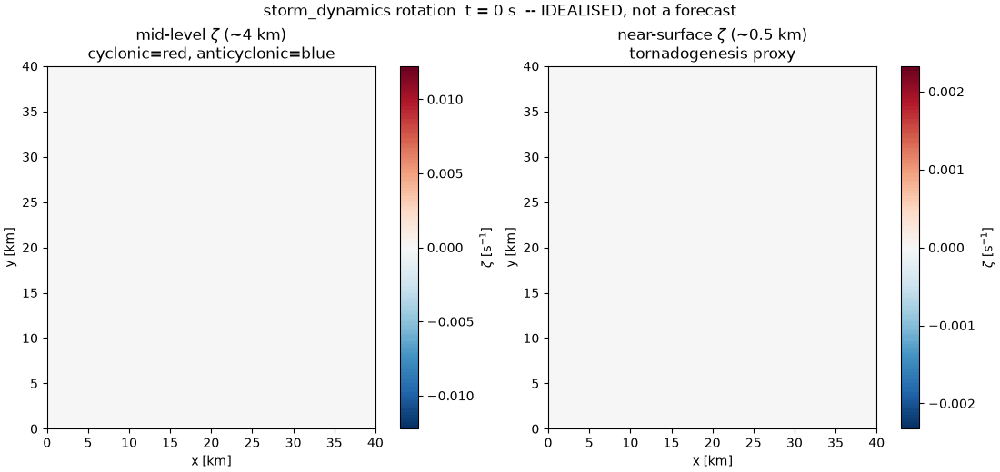
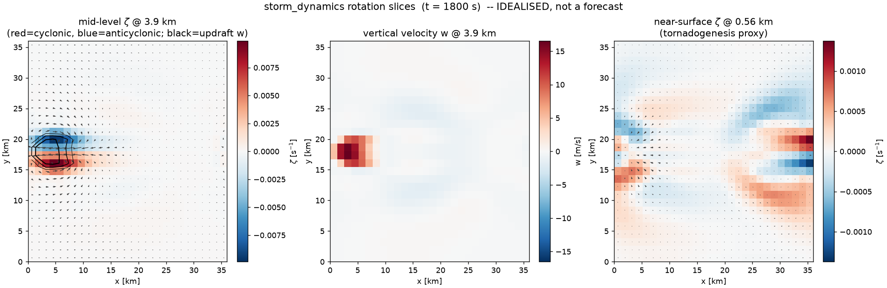
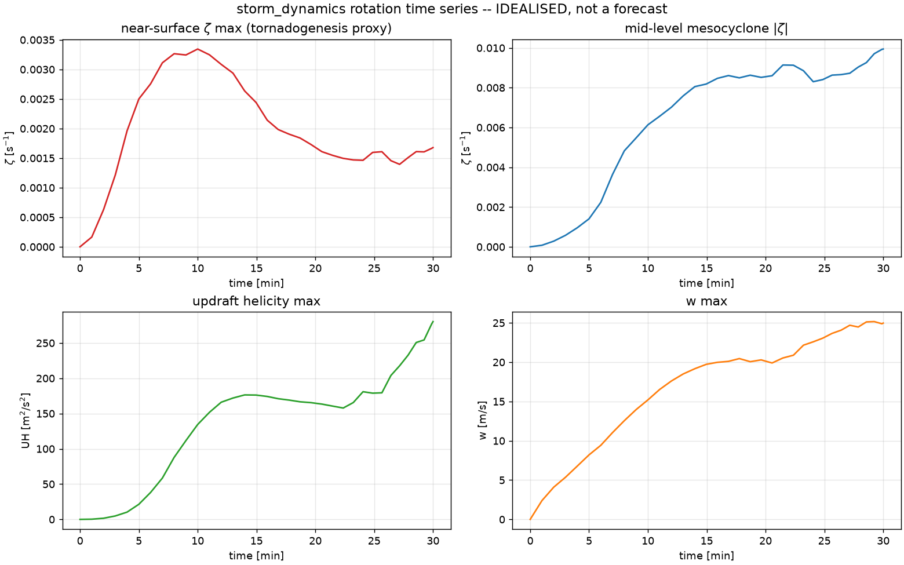
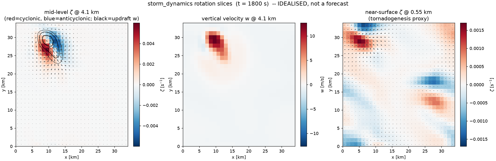
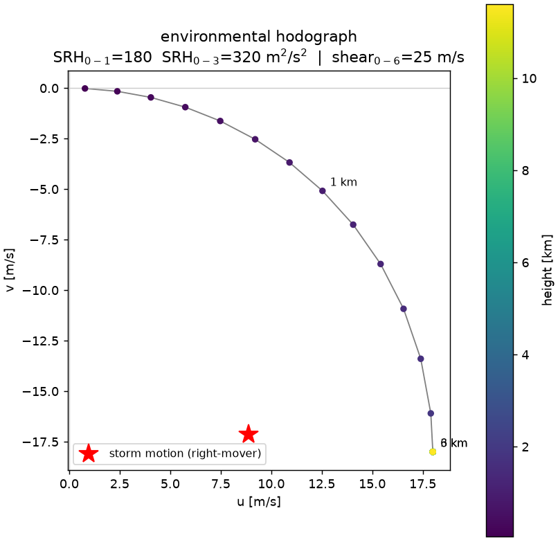
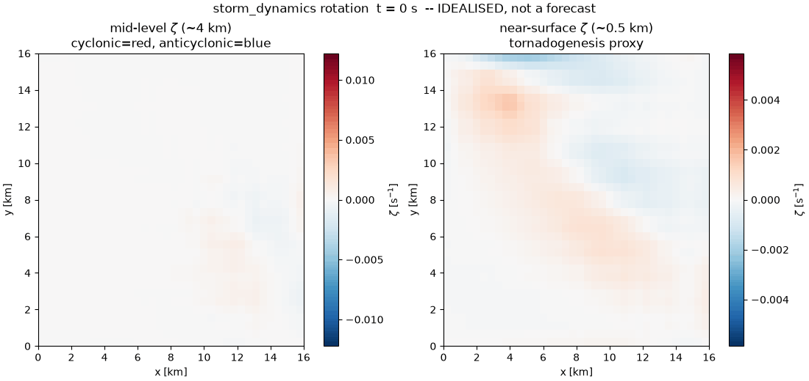
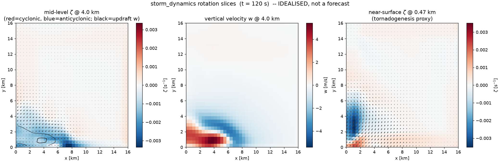
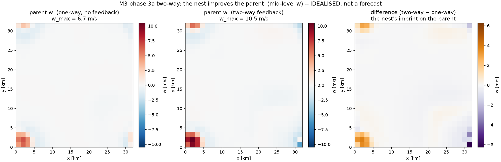
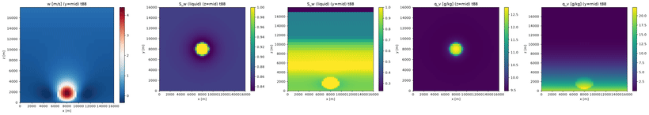

# Water-Phase Nucleation & Flow

## Project at a glance

This open-source atmospheric simulation framework connects
**thermal-gradient-shifted water nucleation** with **three-dimensional flow**
and **precipitation microphysics**.

The repository includes reproducible liquid- and ice-phase scenarios,
NetCDF/CSV/JSON output, conservation and numerical tests, visualization tools,
and an explicit account of the physical assumptions and limitations. It is
intended as a **research and verification platform**, not an operational
weather-forecasting system.

Repository: [meteorological-water-phase-nucleation-application-layer-cfd](https://github.com/ileaof/meteorological-water-phase-nucleation-application-layer-cfd)

---

## Featured — rotating supercell & tornadogenesis (`storm_dynamics`)

The [`storm_dynamics`](src/storm_dynamics/) package adds an **idealised rotating
deep-convection core** — a fork of the `meteorological_flow` dynamical core that
gives a storm the physics it needs to *rotate*: conservative flux-form momentum
advection (tilting + stretching of vorticity), f-plane Coriolis, a Smagorinsky
LES closure (replacing the demonstration Rayleigh drag + velocity clip), a
surface bulk-drag law, and a curved (quarter-circle) hodograph. It reuses the
grid, anelastic pressure projection, conservative transport, bulk microphysics
and the SHA-256-guarded nucleation kernel **unchanged**, and runs on CPU or GPU.

> **Idealised simulation, not a forecast.** No data assimilation, no real event,
> no observational verification; the tornado vortex is under-resolved. See the
> [storm dynamics guide](docs/storm_dynamics_guide.md) and the styled
> [HTML manual](docs/MANUAL_storm_dynamics.html).



*Watch it rotate: mid-level ζ (left) and near-surface ζ (right) over 30 minutes
of a finer-grid GPU run (40×40×48, Δx = 1 km) — the mid-level mesocyclone
organises and the storm splits into cyclonic (red) and anticyclonic (blue)
members. Produced with `--device gpu --plots --animate` (see the cookbook below).*

### M1 — rotating supercell (storm splitting + mid-level mesocyclone)

Under unidirectional shear, a warm bubble grows into a deep updraft that
**splits** into left- and right-moving cells with a mid-level mesocyclone — the
classical Klemp–Wilhelmson / Weisman–Klemp result.



*Left: mid-level vertical vorticity ζ with the perturbation wind (arrows) and the
updraft (black contours) — a near-symmetric **cyclonic (red) / anticyclonic
(blue) couplet** straddling the updraft is the split-supercell mesocyclone.
Centre: vertical velocity. Right: near-surface ζ. (40×40×48, Δx = 1 km, on GPU,
30 min; w_max ≈ 25 m/s, mesocyclone ≈ 1.2×10⁻² s⁻¹, updraft helicity ≈ 435 m²/s²
— note the stronger rotation at finer resolution.)*



*The mid-level mesocyclone spins up monotonically as tilting and stretching
organise the rotation; near-surface ζ peaks early then decays — a straight
hodograph with no surface friction cannot hold low-level rotation.*

### M2 — low-level rotation (tornadogenesis proxy)

A curved hodograph with surface drag and an evaporative cold pool **sustains**
vertical vorticity near the surface on the cold-pool / forward-flank interface.



*The mid-level couplet now sits under a coherent rotating updraft (centre), and
near-surface ζ (right) concentrates at the cold-pool interface with the inflow
converging into a cyclonic patch — the low-level rotation surface friction and
the cold pool make possible (near-surface ζ ≈ 3.5×10⁻³ s⁻¹, sustained, ≈2.4× an
identical straight-hodograph/no-drag control).*



*The quarter-circle hodograph veers through the lowest ~2 km; that curvature is
the source of the strong positive storm-relative helicity (0–1 km ≈ 148 m²/s²)
that feeds the low-level vortex.*

### M3 — nested-grid refinement of the vortex (phases 1, 2, 2b)

Mature the storm on the coarse **parent**, then integrate a finer **nest** over
the updraft / low-level-rotation region, with the nest border relaxed toward the
parent. The finer grid **sharpens** the near-surface vortex.

**Phase 2b — storm-following nest (the sustained, long animation).** Running the
nest in the **storm-relative frame** keeps the cell centred, so the finer mesh
**sustains and intensifies the updraft from ~7 to ~23 m/s over 500 s** (growing
the whole window) while conserving to ~0.35% — a strengthening updraft and a
concentrated low-level vortex a fixed nest would have lost.



*Storm-following nest (`--follow`, Δx = 0.44 km, motion C ≈ (9, −18) m/s): 500 s
of a sustained, intensifying updraft and low-level rotation. Mid-level ζ (left)
and near-surface ζ (right).*

<details><summary><b>Phase 1 — static nest (short window), and the boundary comparison</b></summary>



*Phase 1 (frozen parent border, 120 s): the finer grid **intensifies near-surface
ζ ≈ 2.4×** over a short window, then decays as the frozen border stops feeding
fresh inflow. Boundary comparison — updraft over the window: frozen 7.3→4.1
(decays) · concurrent fixed 7.6→2.0 (decays) · **concurrent following 5→23
(grows)**.*

</details>

**Phase 3a — two-way (the nest improves the parent).** Feeding the nest's finer
solution back onto the parent closes the loop:



*Same case, parent updraft (mid-level w): **one-way 6.7 m/s → two-way 10.5 m/s**.
Right panel: the difference — the orange patch is exactly where the nest
strengthened the parent updraft (+3.8 m/s), the signature of two-way coupling.
Injection feedback (not rigorous refluxing); stable, water ≈ −0.1%.*

> **Honest scope.** Delivered: nesting phases 1 (static/frozen), 2
> (concurrent/time-evolving boundary), 2b (storm-following), and **3a (approximate
> two-way** — the nest's finer solution blended back onto the parent, improving it).
> All in `storm_dynamics.nesting` / `examples/tornado_nest.py`
> (`--concurrent`, `--follow`, `--two-way`).
>
> **The AMR algorithms are now all built and verified** (`storm_dynamics.amr`,
> `poisson_mg`, `composite_poisson`, `amr_port`): Berger–Colella **refluxing** (mass
> drift `2e-16` vs `1.1e-4` without), conservative restriction/prolongation and
> free-stream preservation (exact), a **geometric-multigrid Poisson** (h-independent,
> 2nd order), the **composite coarse–fine interface stencil in 1-D/2-D/3-D** (2nd
> order including the patch corners, conservative), and the **two-level MAC
> projection** in 2-D/3-D — a face velocity made discretely divergence-free to
> `~1e-13` *across the refinement interface*. That projection **is** the anelastic
> projection in mass-flux variables (`m = ρ₀u`), so no new algorithm remains.
>
> The three integration pieces are done and verified — the **solid-wall BC**, the
> **staggered mass-flux face bridge** (`composite_project_massflux_2d`), and the
> **stretched-z vertical metric** — and the **final assembly** is built:
> `solve_composite_hz` (the unified operator, horizontal composite interface at every
> z-level + variable-dz vertical, verified 2nd order) and `composite_project_massflux_hz`
> (the full 3-D projection on the storm's staggered C-grid mass fluxes, `div(m)→0` across
> the interface to `~1e-13` for the nest walls and the parent). **Every AMR-projection
> ingredient is now implemented and tested; the only remaining step is the call site**
> (form `ρ₀u*`, project, recover `u = m/ρ₀`, write back into the two `FlowState`s) plus
> **adaptive/dynamic regridding**. The rigorous plan and the exact call-site recipe are
> in [`docs/amr_design.md`](docs/amr_design.md).

Reproduce with:

```bash
# M1 — rotating supercell (storm splitting), CPU (default):
python examples/supercell_tornadogenesis.py --scenario supercell      --plots

# M2 — tornadogenesis (curved hodograph + surface drag + evaporative cold pool), CPU:
python examples/supercell_tornadogenesis.py --scenario tornadogenesis --plots

# the same M2 run on GPU (NVIDIA + CuPy) -- identical physics/output, just faster
# at larger grids; --device gpu fails loudly (not silently) if no working GPU:
python examples/supercell_tornadogenesis.py --scenario tornadogenesis --plots --device gpu

# --device auto: GPU when available, else CPU, with the fallback reason logged:
python examples/supercell_tornadogenesis.py --scenario supercell --device auto

# couple the validated nucleation kernel (eq39 pathway) as the microphysics embryo
# source instead of CCN/IN activation (builds a lookup table once, then cached):
python examples/supercell_tornadogenesis.py --scenario tornadogenesis \
    --kernel-nucleation --plots --device gpu

# a bigger tornadogenesis grid (finer near-surface resolution, longer run) -- GPU
# pays off once the grid is large enough that the pressure solve uses CG:
python examples/supercell_tornadogenesis.py --scenario tornadogenesis \
    --nx 48 --ny 48 --nz 56 --duration 3600 --plots --device gpu

# finer grid on GPU with graphs + an animated GIF + a CSV time series
# (the "finer grid, GPU, graphs, animation" recipe end to end):
python examples/supercell_tornadogenesis.py --scenario supercell \
    --nx 40 --ny 40 --nz 48 --Lx 40000 --Ly 40000 --Lz 16000 \
    --duration 1800 --device gpu --plots --animate --csv --fps 10 \
    --outdir outputs/storm_m1_fine_gpu

# M3 phase 1 -- static nested-grid refinement: mature the parent, then run a
# finer nest over the vortex region (intensifies near-surface zeta over a window):
python examples/tornado_nest.py --refine 3 --window 120 --plots --animate

# quick smoke test (tiny grid, short duration) to sanity-check a change fast:
python examples/supercell_tornadogenesis.py --scenario supercell \
    --nx 8 --ny 8 --nz 10 --duration 30 --device auto
```

| Option | Default | What it does |
|---|---|---|
| `--scenario {supercell,tornadogenesis}` | `supercell` | M1 (unidirectional shear) or M2 (curved hodograph + drag) |
| `--nx --ny --nz` | `32 32 40` | grid resolution (finer = higher fidelity, heavier) |
| `--Lx --Ly --Lz` | `40000 40000 16000` | domain size [m] (`dx = Lx/nx`) |
| `--duration` / `--dt-max` | `2400` / `3.0` | integration time / max time step [s] |
| `--device {cpu,gpu,auto}` | `cpu` | compute backend (`gpu` needs NVIDIA + CuPy; `auto` falls back to CPU) |
| `--plots` | off | write hodograph, rotation-slice and time-series PNGs |
| `--animate` / `--fps` | off / `8` | write an animated GIF of the evolving vorticity |
| `--csv` | off | write the rotation/conservation time series to `history.csv` |
| `--kernel-nucleation` | off | feed the validated nucleation kernel `J` as the microphysics embryo source |
| `--outdir` | `outputs/storm_<scenario>` | where figures / GIF / CSV are written |

> **Milestones — are we on M2 or M3?** M1 (rotating supercell: splitting +
> mid-level mesocyclone) and **M2** (sustained low-level rotation) are delivered
> and verified. A globally finer grid (above) improves fidelity and is fully
> supported, but it is **not M3**: M3 means *nested refinement / AMR* to resolve
> the ~10–100 m tornado vortex, which is future work — the core is left prepared
> for it, not yet implemented.

`--device cpu` (default) preserves the original CPU-only behaviour with no GPU
probing at all; CPU/GPU parity is regression-tested
(`test_storm_gpu_matches_cpu`, skipped automatically when no GPU is present).
See the [storm dynamics guide](docs/storm_dynamics_guide.md)'s "Compute backend
(CPU / GPU)" section for the full `--device`/config semantics and when GPU is
actually worth it at these demonstration grid sizes.

---

**Reference Manual — `met_h2o_nucleation` + `meteorological_flow`**

A unified manual for the Ferreira Eq.39a/39b shifted-equilibrium nucleation
engine and the 3D Boussinesq mixing-chamber flow solver built around it.
**Part I** documents the validated kernel and its application/diagnosis layer;
**Part II** documents the CPU flow package that drives it one-way.

`Engine: self-checks pass` · `Flow: Batch-1 gate passed` · `Core: SHA-256 guarded` · `Boussinesq · C-grid · Chorin`

> A Markdown translation of [`docs/MANUAL.html`](docs/MANUAL.html). See also the
> [precipitation-microphysics guide](docs/microphysics_guide.md), the
> [flow guide](docs/flow_guide.md) and the
> [hypotheses table](docs/MET_NUCLEATION_HYPOTHESES.md).

---

## Table of contents

**Part I · The nucleation engine**

1. [What this module is](#1-what-this-module-is) ·
2. [Dependencies](#2-dependencies) ·
3. [Installation & quick start](#3-installation--quick-start) ·
4. [Constants & re-exported symbols](#4-constants--re-exported-core-symbols) ·
5. [Input — `MetInput`](#5-input--metinput) ·
6. [Humidity helpers](#6-humidity-helpers) ·
7. [Free-energy decomposition](#7-free-energy-decomposition) ·
8. [Precipitation diagnosis](#8-precipitation-diagnosis) ·
9. [Output — 48-field report](#9-output--metnucleationreport) ·
10. [Runner](#10-runner--metnucleationrunner) ·
11. [I/O adapters](#11-io-adapters) ·
12. [Visualisation](#12-visualisation--metnucleationplotter) ·
13. [Self-checks](#13-self-checks--validation) ·
14. [Command-line reference](#14-command-line-reference) ·
15. [Examples](#15-examples) ·
16. [Conventions](#16-conventions) ·
17. [Validity & hypotheses](#17-validity-ranges--what-remains-hypothesis) ·
18. [Troubleshooting](#18-troubleshooting) ·
19. [Citation & license](#19-citation--license) ·
20. [File map](#20-file-map)

**Part II · The 3D flow solver**

21. [The flow package](#21-the-flow-package) ·
22. [Formulation](#22-formulation) ·
23. [Scientific integrity](#23-scientific-integrity) ·
24. [Consequences & limitations](#24-documented-consequences--limitations) ·
25. [Running it](#25-running-it) ·
26. [Outputs & the gate](#26-outputs--the-verification-gate)

**Part III · Precipitation microphysics**

27. [Precipitation microphysics](#27-precipitation-microphysics) ·
28. [High-precipitation & hail — running setup](#28-high-precipitation--hail--running-setup)

---

# Part I — The nucleation engine

The application/diagnosis layer for the Ferreira Eq.39a/39b shifted-equilibrium
framework (Ferreira, I. L., *Physica B: Condensed Matter* **695** (2024) 416494;
MRS Meeting 2026 — see [§19](#19-citation--license)). The validated physics core
is bundled, imported read-only, and never modified.

## 1. What this module is

`met_h2o_nucleation.py` computes, for one or more atmospheric states:

- **vapour → liquid** (condensation) and **vapour → ice** (deposition)
  nucleation, homogeneous or heterogeneous;
- the **non-equilibrium thermal closure** (radius as continuation variable,
  gradient as the Brent-solved unknown);
- the **2nd-order Gibbs–Thomson coefficient** and **1st/2nd-order critical
  radii** (Ferreira Eq.39b parabola, heterogeneous with ∂f/∂r);
- the **free-energy decomposition** ΔG_V / ΔG_bulk / ΔG_surface / ΔG_config /
  ΔG_total at the evaluated radius;
- the **shifted equilibrium pressure** P_eq,shift = P_sat,phase(T_local);
- the **nucleation rate** I and log₁₀ I (overflow-safe) and the expected event
  count in a cell/timestep;
- transparent **rain / snow / graupel / hail favourability indices** (0..1) with
  contributing / missing variables, confidence and a caveat — *a high rate never
  by itself implies precipitation*;
- ingestion of scalars, profiles, time series, **xarray / NetCDF / GRIB** fields
  and structured **JSON / CSV / NetCDF** output;
- optional **PNG figures**.

All internal quantities are **SI**. When a quantity cannot be determined from
the inputs it is reported as `"undetermined"` (the constant `NA`) with the
missing information named.

### 1.1 Architecture

```
                 +-------------------------------+
   met input --> |  met_h2o_nucleation.py         |  <-- application/diagnosis layer
                 |  MetInput / Runner / Diagnosis |
                 |  free-energy decomp / IO / viz |
                 +---------------+---------------+
                                 |  imports READ-ONLY (importlib)
                                 v
                 +-------------------------------+
                 |  unified_h2o_nucleation_      |  <-- validated core (DO NOT MODIFY)
                 |  climate.py                   |      closure, r_C, Gamma, rate, tests [1]-[21]
                 +-------------------------------+
```

The core closure (F(g;r)=Γ²/(4πr²)−g=0), the critical-radius parabola, the
surface-stress law, the nucleation rate and the validation suite (incl. the
ice-reference SHA-256 guard) are **delegated** to the core. This layer adds only
what the core deliberately does not own: free-energy decomposition, precipitation
diagnosis, I/O adapters, the full report schema, visualisation.

### 1.2 The physics in brief

Classical nucleation theory fixes the critical radius from a balance of bulk and
surface free energy at a *single* equilibrium. This framework (Ferreira,
Eq. 39a/39b) treats nucleation under a **thermal gradient** instead: a non-zero
∇T across the embryo *shifts* the local equilibrium, so the saturation pressure
the germ actually sees is `P_eq,shift = P_sat,phase(T_local)` rather than
`P_sat,phase(T_ambient)`. What the tool reports follows from that shift:

- the **closure** `F(g;r) = Γ²/(4πr²) − g = 0` ties the gradient `g = ∇T` to the
  continuation radius `r`; with `r` pinned at `r_ref`, the gradient is the
  Brent-solved unknown (or you prescribe it with `--gradT`);
- the **critical radius** is the root of a **2nd-order (parabolic) stationarity**
  condition (Eq. 39b), reported as `r_critical_2nd_m` — the principal result —
  next to the classical 1st-order value for comparison;
- the **nucleation barrier and rate** follow from the shifted state and are
  decomposed into bulk / surface / configurational parts;
- everything downstream (rate → favourability → diagnostic class) is a
  *diagnosis* of this shifted-equilibrium state. The tool never invents
  hydrometeor growth, and never turns a high rate into a precipitation forecast.

Read `∇T` here as the **local** temperature gradient at the embryo interface
(validated 1–10⁴ K/m), not a synoptic front gradient (~10⁻³ K/m).

## 2. Dependencies

| Package | Required? | Used for |
|---|---|---|
| `numpy` | yes | arrays, numerics |
| `scipy` | yes | `brentq` (thermal closure); imported by the bundled core at load |
| `matplotlib` | yes | imported by the bundled core at load (headless `Agg`); also drives `MetNucleationPlotter` figures |
| `xarray` | optional | `from_xarray`, `to_xarray`, NetCDF I/O |
| `netCDF4` / `h5netcdf` | optional | NetCDF4/HDF5 read/write |
| `cfgrib` + `eccodes` | optional | GRIB ingestion |
| `pandas` | optional | convenience |

`numpy`, `scipy` and `matplotlib` are **required** just to import the package,
because the bundled core imports all three at load time. The remaining backends
are optional: if one is absent the relevant path **degrades gracefully** to
`"undetermined"` (naming the missing dependency) rather than crashing
(`from_grib` raises a clear `RuntimeError`; `from_netcdf` tries
`netcdf4 → h5netcdf → scipy` and falls back to NetCDF3 via scipy). Install
everything with `pip install -r requirements.txt`.

The validated core is **bundled** under
`src/met_water_nucleation/_engine/unified_h2o_nucleation_climate/` and loaded via
`importlib`, so it runs from any working directory with **no `PYTHONPATH`**. The
core and its two SHA-256-guarded reference models are **never modified**.

## 3. Installation & quick start

### 3.1 Install

```bash
git clone https://github.com/ileaof/meteorological-water-phase-nucleation-application-layer-cfd.git
cd meteorological-water-phase-nucleation-application-layer-cfd
python -m pip install -r requirements.txt      # numpy, scipy, matplotlib (required)
python met_h2o_nucleation.py --validate         # prove the bundled core is intact -> SELF-CHECKS PASS
```

Requires **Python ≥ 3.9**. The repository is **self-contained**: the validated
core, the `het_contact_angle` module and the two SHA-256-guarded reference models
are all bundled. A successful `--validate` run ends with `SELF-CHECKS PASS`.

### 3.2 Command line

```bash
# one state, both phases, supersaturated, with dynamics + a JSON dump:
python met_h2o_nucleation.py --T 260 --P 70000 --RH 110 --phase-mode both --w 2.0 --LWC 5e-4 --IWC 1e-4 --dt 60 --cell-volume 1e6 --json outputs/cli_report.json

# prove the core is untouched and the met-layer self-checks pass:
python met_h2o_nucleation.py --validate
```

The CLI prints the full 48-field report for each admissible phase. See §14.

### 3.3 Python API (minimal)

```python
import met_water_nucleation as M

met = M.MetInput(T=260.0, P=70000.0, RH=110.0, rh_reference="water",
                 phase_mode="both", mode="homogeneous",
                 w=2.0, LWC=5e-4, IWC=1e-4, cooling_rate=-2.0e-4,
                 N_ccn=3.0e8, N_inp=1.0e4,
                 dt_micro=60.0, cell_volume=1.0e6)

runner = M.MetNucleationRunner(met)
p_v, src, warns = M.resolve_humidity(met, 260.0, 70000.0)   # -> Pa
reps = runner.evaluate_point(260.0, 70000.0, p_v,
                             dynamics={"w": 2.0, "LWC": 5e-4, "IWC": 1e-4})

for phase, report in reps.items():          # dict[phase] -> MetNucleationReport
    print(phase, report.status, report.log10_nucleation_rate,
          report.r_critical_2nd_m, report.diagnostic_class)

M.to_json(reps, "out.json")                  # full 48-field schema
```

## 4. Constants & re-exported core symbols

| Name | Value / source | Meaning |
|---|---|---|
| `PHASE_LIQUID` / `PHASE_ICE` | `"liquid"` / `"ice"` | phase tags |
| `Tt` | 273.16 K | triple-point temperature |
| `Pt` | 611.657 Pa | triple-point pressure |
| `THETA0` | radians(45) | default contact angle — **brentq fallback only**; θ is solved by Eq. 17 and reported as `contact_angle_deg` |
| `R_REF_DEFAULT` | 1e-7 m | default continuation radius |
| `T_MIN_LOCAL` | 233 K | deep-supercooling lower bound (extrapolation flag) |
| `EPS_MW` | 0.622 | M_H2O / M_dry_air |
| `NA` | `"undetermined"` | "could not be determined" sentinel |
| `MANDATORY_FIELDS` | list[str] | the 48-field output schema (order) |
| `UNITS` | dict[str,str] | SI unit of each output field |
| `FIELD_ALIASES` | dict[str,list] | accepted input variable names per canonical field |

Re-exported from the core: `SaturationProperties`, `UnifiedNucleationSimulator`,
`AtmosphericInput`, `LiquidNucleationModel`, `IceNucleationModel`, `ftheta`.

`ftheta(θ) = 2 − 3 cos θ + cos³ θ` (un-normalised, 0..4); the heterogeneous
factor used internally is `ftheta(θ)/4` (normalised, 0..1).

## 5. Input — `MetInput`

A dataclass holding the thermo fields shared with the core **plus** the
dynamic/microphysical/coordinate fields the core does not carry. Scalars, 1-D
arrays (profiles / time series) or callables are accepted. Dynamic/microphysical
fields default to `None` → `"undetermined"` in the report.

### 5.1 Thermodynamic fields (shared with core)

| Field | Type | Default | Unit | Notes |
|---|---|---|---|---|
| `T` | float/array/callable | `258.15` | K | ambient temperature |
| `P` | float/array/callable | `70000.0` | Pa | **total** atmospheric pressure |
| `RH` | optional | `None` | % | relative humidity |
| `rh_reference` | str | `"water"` | — | `"water"` or `"ice"` |
| `y_v` | optional | `None` | 0..1 | vapour mole fraction |
| `p_v` | optional | `None` | Pa | vapour **partial** pressure |
| `q_v` | optional | `None` | kg/kg | specific humidity |
| `r_mix` | optional | `None` | kg/kg | mass mixing ratio |
| `grad_T` | optional | `None` | K/m | requested \|dT/dr\| (else solved) |

At least one of `p_v, RH, y_v, r_mix, q_v` must be provided (see `resolve_humidity`).

### 5.2 Continuation / heterogeneous

| Field | Default | Unit | Notes |
|---|---|---|---|
| `r_ref` | `R_REF_DEFAULT` (1e-7) | m | continuation radius |
| `theta` | `THETA0` (45°) | rad | contact angle — **solver fallback only**; θ is *calculated* by Eq. 17 and reported as `contact_angle_deg` |
| `mode` | `"homogeneous"` | — | `"homogeneous"` or `"heterogeneous"` |
| `phase_mode` | `"auto"` | — | `auto` / `liquid` / `ice` / `both` |

`phase_mode` semantics: `auto` — compute the admissible phase(s) and report the
kinetically dominant one; `both` — compute liquid and ice side by side;
`liquid` / `ice` — single phase.

### 5.3 Dynamic / microphysical (new, not in core)

| Field | Unit | Meaning |
|---|---|---|
| `w` | m/s | vertical velocity (updraft) |
| `LWC` | kg/m³ | liquid water content |
| `IWC` | kg/m³ | ice water content |
| `N_ccn` | 1/m³ | cloud condensation nuclei number concentration |
| `N_inp` | 1/m³ | ice nucleating particle number concentration |
| `cooling_rate` | K/s | dT/dt (**<0 means cooling**) |
| `dt_micro` | s | microphysics timestep (enables `expected_events`) |
| `cell_volume` | m³ | grid-cell volume (enables `expected_events`) |
| `freezing_level` | m | altitude of the 0 °C isotherm |

### 5.4 Coordinates / metadata

`z` (geopotential altitude, m), `lat`, `lon`, `time` (s since reference) — all
optional, carried through to output. `__post_init__` validates `phase_mode`,
`mode`, `rh_reference` and raises `ValueError` on a bad value.

## 6. Humidity helpers

```python
p_v, source, warnings = M.resolve_humidity(met, T, P)   # -> (Pa, str, list[str])
```

Resolves `p_v` [Pa] from whichever humidity input is given, **cross-checking
consistency** when more than one is provided (1 % relative tolerance).
`source` is one of `"p_v"`, `"RH"`, `"y_v"`, `"r_mix"`, `"q_v"`. Uses the core's
`SaturationProperties` correlations (IAPWS Wagner liquid, Goff-Gratch ice).

```
p_v = r · P / (r + ε)        r = ε · p_v / (P − p_v)
q   = r / (1 + r)             r = q / (1 − q)            ,  ε = 0.622
```

Helpers: `mixing_ratio_from_p_v(p_v, P)`, `specific_humidity_from_p_v(p_v, P)`.

## 7. Free-energy decomposition

```python
fe = M.free_energy_decomposition(model, st, theta)   # -> dict
```

Decomposes the nucleation free energy at the evaluated radius `st['r']`, using
the core model's own hooks — **no re-derivation of the physics**. Returns:

| Key | Unit | Definition |
|---|---|---|
| `DeltaG_V_J_m3` | J/m³ | ΔS_V · ΔT |
| `DeltaS_bulk` | J/(m³·K) | volumetric entropy change |
| `DeltaG_bulk_J` | J | (4π/3) r³ ΔG_V |
| `DeltaG_surface_J` | J | 4π r² γ(r, T_local) |
| `DeltaG_config_J` | J | (f/4 − 1)·(ΔG_bulk + ΔG_surface) (hetero correction) |
| `DeltaG_total_J` | J | (f/4)·(ΔG_bulk + ΔG_surface) |
| `f_theta` | — | `2 − 3cos θ + cos³ θ` |
| `f_theta_normalised` | 0..1 | `f/4` |

Homogeneous limit θ = π → f/4 = 1 → `DeltaG_config_J = 0`. The *critical*
barriers ΔG_C come from the validated core (`r_C_1st` / `r_C_2nd`) and are
reported separately as `DeltaG_critical_1st_J` / `DeltaG_critical_2nd_J`.

## 8. Precipitation diagnosis

### 8.1 `Favorability` dataclass

| Field | Meaning |
|---|---|
| `value` | 0..1 favourability |
| `contributing_vars` | factors present and contributed |
| `missing_vars` | factors absent |
| `confidence` | 0..1 = (#present ideal factors)/(#ideal) |
| `explanation` | short physical explanation |
| `caveat` | standard caveat when confidence is low |

### 8.2 `PrecipitationDiagnosis`

```python
diag = M.PrecipitationDiagnosis(T, S_w, S_i, log10I, phase,
                                 w=None, LWC=None, IWC=None, cooling_rate=None,
                                 freezing_level=None, N_ccn=None, N_inp=None, z=None)
rain  = diag.rain()      # -> Favorability
snow  = diag.snow()
graup = diag.graupel()
hail  = diag.hail()
klass = diag.diagnostic_class()
```

> **Honesty guard.** A high nucleation rate **never by itself** implies rain or
> hail — hydrometeor growth (condensation/deposition, collision-coalescence,
> accretion, riming, melting/refreezing) is **not modelled**. When the
> dynamic/microphysical data are absent, the index reflects thermodynamic
> favourability only, confidence is low, and the caveat is attached:
> *"Thermodynamically favourable to nucleation, but the dynamic and microphysical
> data are insufficient to confirm precipitation or hail."* Caveat triggers:
> confidence < 0.5 for rain/snow/graupel; < 0.75 for hail.

The elementary normalised factors are transparent (no hidden tuning): e.g.
`thermo_supw = (S − 1)/0.20`, `cold = (273.15 − T)/40`, `updraft = w/5`,
`hail_updraft = (w − 5)/15`, `LWC = LWC/1e-3`, etc. `_combine` is a weighted mean
over present factors (equal weights, renormalised) — absent factors do not
penalise the value but lower the confidence.

`diagnostic_class()` returns: `subsaturated`, `saturated_water`, `saturated_ice`,
`condensation_favorable`, `warm_rain`, `mixed_phase`, `supercooled_liquid`,
`deposition_favorable`, `insufficient_data`.

> **Beyond nucleation.** A companion package, [`precip_microphysics`](docs/microphysics_guide.md),
> adds the full hydrometeor chain (growth, sedimentation, phase change) and an
> **evidence-based** confidence/diagnostic-level model that only *confirms*
> precipitation when the growth and surface-flux evidence is actually present.

## 9. Output — `MetNucleationReport`

One record per phase per ambient point. Carries the 48 mandatory fields plus
`favorability_detail`, `metadata`, and the assumptions/warnings/validity_flags
lists. Use `report.to_dict()` for a plain dict (NaN → `None`).

The 48-field schema (abridged): `status`, `phase`, `nucleation_mode`,
`contact_angle_deg`, `T_ambient_K`, `T_local_K`, `P_total_Pa`, `p_v_Pa`,
`RH_water_percent`, `RH_ice_percent`, `S_water`, `S_ice`, `gradT_K_m`,
`DeltaT_K`, `P_eq_classical_Pa`, `P_eq_shift_Pa`, `DeltaP_eq_Pa`, `gamma_J_m2`,
`dgamma_dr_J_m3`, `surface_stress_N_m`, `DeltaS_bulk`, `DeltaG_V_J_m3`,
`DeltaG_bulk_J`, `DeltaG_surface_J`, `DeltaG_config_J`, `DeltaG_total_J`,
`Gamma_1st`, `Gamma_2nd`, `r_critical_1st_m`, `r_critical_2nd_m` *(principal
result)*, `DeltaG_critical_1st_J`, `DeltaG_critical_2nd_J`,
`nucleation_rate_m3_s`, `log10_nucleation_rate`, `expected_events`,
`dominant_phase`, `rain_favorability`, `snow_favorability`,
`graupel_favorability`, `hail_favorability`, `diagnostic_class`, `confidence`,
`assumptions`, `warnings`, `validity_flags`, `solver_iterations`,
`closure_residual`, `critical_radius_residual`.

Validity flags: `in_valid_range` / `out_of_range`, `supercooled_liquid_meta`,
`T_local_near_lower_bound_extrapolated`, `above_triple_point_liquid_stable`,
`subsaturated`, `no_solution`. The metadata block carries `units`,
`sign_conventions`, `sources`, `validity_ranges`, and a note that hydrometeor
growth is not modelled.

## 10. Runner — `MetNucleationRunner`

```python
runner = M.MetNucleationRunner(met)
reps = runner.evaluate_point(T, P, p_v, grad_T=None, dynamics=None)
```

| Driver | Signature | Returns |
|---|---|---|
| `evaluate_point` | `(T, P, p_v, grad_T=None, dynamics=None)` | `dict[phase] → MetNucleationReport` |
| `evaluate_profile` | `(T_arr, P_arr, p_v_arr, z_arr, dyn_arrs=None)` | `list[dict]` (elementwise) |
| `evaluate_series` | `(T_arr, P_arr, p_v_arr, t_arr, dyn_arrs=None)` | `list[dict]` (elementwise) |

`dynamics` / `dyn_arrs` keys: `w, LWC, IWC, cooling_rate, freezing_level, N_ccn,
N_inp, z` (any subset; absent → `"undetermined"`). Solver iterations are captured
via `brentq(..., full_output=True)`; the core `AtmosphericInput` is built without
modifying the core class.

## 11. I/O adapters

**Ingestion.** `from_xarray(ds)` (name-tolerant field mapping via
`FIELD_ALIASES`; missing → `None`), `from_netcdf(path)` (tries
`netcdf4 → h5netcdf → scipy`), `from_grib(path)` (requires `cfgrib`; clear
`RuntimeError` if absent).

**Output.** `reports_to_records`, `to_json` (NaN → `null`), `to_csv` (48 columns
in `MANDATORY_FIELDS` order; NaN/None → `NA`), `to_xarray` (numeric fields over an
unnamed `phase` dimension; string phase-name mapping stored in
`ds.attrs['phase_names']`), `to_netcdf` (scipy engine → NetCDF3 unless
netCDF4/h5netcdf present).

## 12. Visualisation — `MetNucleationPlotter`

```python
plot = M.MetNucleationPlotter("out_met_nucleation")   # uses the Agg backend
```

| Method | Output file |
|---|---|
| `plot_peq_shift_surface(phase, ...)` | `peq_shift_surface_{phase}.png` |
| `plot_gibbs_thomson_and_radii(...)` | `gt_and_radii_{phase}.png` |
| `plot_free_energy(model, ...)` | `free_energy_vs_r.png` |
| `plot_rates(reports_liquid, reports_ice)` | `rates_vs_T.png` |
| `plot_vertical_profile(...)` | `vertical_profile.png` |
| `plot_favorability_bars(report)` | `favorability_bars.png` |

The complete figure suite is generated by **`examples/figures.py`**.

## 13. Self-checks & validation

```python
M.run_self_checks(verbose=True)   # -> bool
# 1) runs the CORE validation suite [1]-[21] (proves the core is untouched);
# 2) met-layer free-energy identity (DeltaG_total == bulk + surface + config);
# 3) runner end-to-end at one point (favourability in [0,1], confidence in [0,1]).
```

Or from the CLI: `python met_h2o_nucleation.py --validate`. The full 24-test
suite lives in `tests/test_met_nucleation.py` (`python -m pytest tests/`).

## 14. Command-line reference

```
python met_h2o_nucleation.py [--validate]
        [--T K] [--P Pa] [--RH %] [--p-v Pa]
        [--phase-mode auto|liquid|ice|both]
        [--mode homogeneous|heterogeneous]
        [--theta DEG] [--r-ref m] [--gradT K/m]
        [--w m/s] [--LWC kg/m3] [--IWC kg/m3]
        [--dt s] [--cell-volume m3]
        [--outdir DIR] [--json PATH] [--summary]
```

| Flag | Default | Meaning |
|---|---|---|
| `--validate` | off | run core [1]-[21] + met self-checks; exit 0/1 |
| `--T` | 260.0 | ambient temperature [K] |
| `--P` | 70000.0 | **total** pressure [Pa] |
| `--RH` | — | relative humidity [%] (cross-checked if others given) |
| `--p-v` | — | vapour **partial** pressure [Pa] (alternative to `--RH`) |
| `--phase-mode` | `auto` | `auto` / `liquid` / `ice` / `both` |
| `--mode` | `homogeneous` | `homogeneous` / `heterogeneous` |
| `--theta` | 45 (THETA0) | heterogeneous contact angle [deg] — **brentq fallback only**; θ is solved by Eq. 17 |
| `--r-ref` | 1e-7 | continuation radius [m] |
| `--gradT` | — | requested thermal gradient [K/m] (else Brent-solved) |
| `--w` `--LWC` `--IWC` | — | dynamics / water contents |
| `--dt` `--cell-volume` (alias `--Vcell`) | — | timestep + subgrid **control (parcel) volume** [m³] for `expected_events = I·dt·V_cell` — the **local cell** volume, **not** the domain volume (0-D parcel = one cell, so `1e6` = a 100 m parcel). |
| `--outdir` | `out_met_nucleation` | output directory |
| `--json` | — | write the full JSON report to this path |
| `--summary` | off | print the compact one-row-per-phase table instead of the full 48-field report |

Phase admissibility: liquid iff `S_w > 1`, ice iff `S_i > 1`; `both` computes
regardless; `auto` reports only the admissible phase(s) and the kinetically
dominant one.

### 14.1 CLI cases with verified output

The runs below were executed with `--summary` and captured verbatim. The columns
are: `status`, saturation ratios, solved gradient, 2nd-order critical radius,
`log10 I`, dominant phase, the four favourability indices, the diagnostic class,
and `expected_events`. Without `--summary` the CLI prints the full 48-field
vertical report (what is written to `--json`). Same values, different layout.

**Column key:** `phase` liquid/ice · `status` ok/subsaturated · `S_w`,`S_i`
saturation ratios · `gradT` [K/m] Brent-solved (or `--gradT`) · `rC2nd` [m]
2nd-order critical radius · `log10I` [log₁₀ m⁻³s⁻¹] · `dominant` phase with the
larger I · `rain/snow/graup/hail` 0–1 favourability (flags, **not** forecasts) ·
`class` diagnostic class · `exp_events` = I·dt·V_cell.

**Case 1 — both phases, supersaturated, with dynamics + expected events.**

```bash
python met_h2o_nucleation.py --T 260 --P 70000 --RH 110 --phase-mode both --w 2.0 --LWC 5e-4 --IWC 1e-4 --dt 60 --cell-volume 1e6 --summary
```
```
  phase  | status | S_w  | S_i  | gradT | rC2nd    | log10I | dominant | rain  | snow  | graup | hail  | class       | exp_events
  liquid | ok     | 1.10 | 1.25 | 74.33 | 5.11e-06 | 53.10  | liquid   | 0.600 | 0.607 | 0.555 | 0.386 | mixed_phase | 7.61e+60
  ice    | ok     | 1.10 | 1.25 | 148.1 | 4.20e-06 | 49.08  | liquid   | 0.600 | 0.607 | 0.555 | 0.386 | mixed_phase | 7.20e+56
```
> Both phases supersaturated. Liquid wins kinetically (log₁₀I 53.1 vs 49.1);
> r_C,2nd ≈ 5.1e-6 m (liquid). expected_events is enormous — nucleation is not the
> bottleneck; growth is (unmodelled). Class `mixed_phase`.

**Case 2 — auto phase mode (dominant phase reported).**

```bash
python met_h2o_nucleation.py --T 260 --P 70000 --RH 110 --phase-mode auto --summary
```
```
  phase  | status | S_w  | S_i  | gradT | rC2nd    | log10I | dominant | rain  | snow  | graup | hail  | class       | exp_events
  liquid | ok     | 1.10 | 1.25 | 74.33 | 5.11e-06 | 53.10  | liquid   | 0.750 | 0.776 | 0.776 | 0.664 | mixed_phase | undetermined
  ice    | ok     | 1.10 | 1.25 | 148.1 | 4.20e-06 | 49.08  | liquid   | 0.750 | 0.776 | 0.776 | 0.664 | mixed_phase | undetermined
```
> `dominant_phase = liquid` (Δlog₁₀I ≈ 4 decades). `expected_events` is
> `"undetermined"` because no timestep/cell volume was supplied.

**Case 3 — ice-only, RH = 130 %.**

```bash
python met_h2o_nucleation.py --T 258.15 --P 70000 --RH 130 --phase-mode ice --summary
```
```
  phase | status | S_w  | S_i  | gradT | rC2nd    | log10I | dominant | rain  | snow  | graup | hail  | class       | exp_events
  ice   | ok     | 1.30 | 1.51 | 147   | 4.20e-06 | 49.08  | ice      | 1.000 | 0.792 | 0.792 | 0.687 | mixed_phase | undetermined
```
> Only ice computed; `dominant = ice`. The rain index saturates at 1.0 because
> the warm-rain supersaturation factor `(S_w−1)/0.20` clips at 1 — a thermodynamic
> favourability, not a rain forecast.

**Case 4 — heterogeneous nucleation, θ solved by Ferreira Eq. 17.**

```bash
python met_h2o_nucleation.py --T 260 --P 70000 --RH 110 --phase-mode both --mode heterogeneous --theta 60 --summary
```
```
  phase  | status | S_w  | S_i  | gradT | rC2nd    | log10I | dominant | rain  | snow  | graup | hail  | class       | exp_events
  liquid | ok     | 1.10 | 1.25 | 74.33 | 5.11e-06 | 50.93  | liquid   | 0.750 | 0.776 | 0.776 | 0.664 | mixed_phase | undetermined
  ice    | ok     | 1.10 | 1.25 | 148.1 | 4.20e-06 | 46.91  | liquid   | 0.750 | 0.776 | 0.776 | 0.664 | mixed_phase | undetermined
```
> Solved `contact_angle_deg ≈ 180°`: the core carries no substrate surface
> energies, so Eq. 17 has only the homogeneous-limit root θ = π. `--theta 60` is
> the brentq fallback and is **not** used. log₁₀I drops ~2.2 decades vs Case 2.
> r_C,2nd is unchanged (it comes from the closure, independent of θ).

**Case 5 — prescribed thermal gradient (∇T = 1e3 K/m).**

```bash
python met_h2o_nucleation.py --T 260 --P 70000 --RH 110 --phase-mode both --gradT 1e3 --summary
```
```
  phase  | status | S_w  | S_i  | gradT | rC2nd    | log10I | dominant | rain  | snow  | graup | hail  | class       | exp_events
  liquid | ok     | 1.10 | 1.25 | 1101  | 1.34e-06 | 51.94  | liquid   | 0.750 | 0.776 | 0.776 | 0.664 | mixed_phase | undetermined
  ice    | ok     | 1.10 | 1.25 | 1142  | 1.52e-06 | 48.20  | liquid   | 0.750 | 0.776 | 0.776 | 0.664 | mixed_phase | undetermined
```
> Forcing ∇T = 1e3 K/m (≈14× Case 2) collapses r_C,2nd from ~5.1e-6 to ~1.3e-6 m
> and lowers log₁₀I by ~1.2 decades. Saturation ratios are unchanged.

**Case 6 — subsaturated state (no nucleation).**

```bash
python met_h2o_nucleation.py --T 258.15 --P 70000 --RH 80 --phase-mode auto --summary
```
```
  phase  | status       | S_w  | S_i  | gradT  | rC2nd  | log10I | dominant | rain  | snow  | graup | hail  | class        | exp_events
  liquid | subsaturated | 0.80 | 0.93 | undet. | undet. | undet. | none     | 0.000 | 0.125 | 0.125 | 0.188 | subsaturated | undetermined
  ice    | subsaturated | 0.80 | 0.93 | undet. | undet. | undet. | none     | 0.000 | 0.125 | 0.125 | 0.188 | subsaturated | undetermined
```
> S_w = 0.80, S_i = 0.93 — both below 1. status = `subsaturated`, all nucleation
> fields `undetermined`, dominant = `none`. No silent caps, no forced convergence.

**Case 7 — vapour partial pressure directly (p_v = 500 Pa).**

```bash
python met_h2o_nucleation.py --T 260 --P 70000 --p-v 500 --phase-mode both --summary
```
```
  phase  | status | S_w  | S_i  | gradT | rC2nd    | log10I | dominant | rain  | snow  | graup | hail  | class       | exp_events
  liquid | ok     | 2.25 | 2.55 | 74.33 | 5.11e-06 | 53.10  | liquid   | 1.000 | 0.776 | 0.776 | 0.664 | mixed_phase | undetermined
  ice    | ok     | 2.25 | 2.55 | 148.1 | 4.20e-06 | 49.08  | liquid   | 1.000 | 0.776 | 0.776 | 0.664 | mixed_phase | undetermined
```
> `--p-v 500` Pa ⇒ S_w = 2.25, S_i = 2.55. The solved gradient and r_C,2nd are
> identical to Case 2 — the closure depends on T_local, not on how humidity was
> specified.

**Case 8 — warm regime (T = 285 K, RH = 102 %).**

```bash
python met_h2o_nucleation.py --T 285 --P 90000 --RH 102 --phase-mode both --w 1.0 --LWC 3e-4 --dt 60 --cell-volume 1e6 --summary
```
```
  phase  | status | S_w  | S_i  | gradT | rC2nd    | log10I | dominant | rain  | snow  | graup | hail  | class                  | exp_events
  liquid | ok     | 1.02 | 0.91 | 79.62 | 5.11e-06 | 53.06  | liquid   | 0.400 | 0.333 | 0.300 | 0.325 | condensation_favorable | 6.96e+60
  ice    | ok     | 1.02 | 0.91 | 163.5 | 4.20e-06 | 49.11  | liquid   | 0.400 | 0.333 | 0.300 | 0.325 | condensation_favorable | 7.71e+56
```
> T > 273.15 K, S_w = 1.02, S_i = 0.91 (ice subsaturated). Class =
> `condensation_favorable`. The cold factor is 0, so snow/graupel/hail fall to
> their warm-floor. Ice is still computed in `both` mode for comparison.

**Case 9 — self-validation (`--validate`).**

```bash
python met_h2o_nucleation.py --validate
```
```
==============================================================================
SELF-CHECKS  met_h2o_nucleation.py
==============================================================================
[core validation] -> PASS                      (tests [1]-[21], ice SHA-256 unchanged)
[decomposition identity] dG_total==sum: PASS   (free-energy identity)
[runner end-to-end] 2 phases: PASS             (favourability in [0,1], confidence in [0,1])
------------------------------------------------------------------------------
SELF-CHECKS PASS
```
> The core SHA-256 guard (test 18) is the proof that this application layer has
> not modified the validated core.

**Case 10 — warm-moist × cold-dry air-mass collision (frontal mixing cloud).**

A warm, moist air mass (293.15 K, 95 % RH) collides with a cold, dry one
(268.15 K, 40 % RH). Neither parent is saturated, yet isobaric mixing yields a
supersaturated parcel: the supersaturation peaks at mass fraction f = 0.50 →
T = 280.75 K, p_v = 1203.69 Pa, **S_water = 1.153**. That mixed state *is* the
frontal cloud.

```bash
python met_h2o_nucleation.py --T 280.75 --P 90000 --p-v 1203.69 --phase-mode both --w 1.5 --LWC 5e-4 --dt 60 --cell-volume 1e6 --summary
```
```
  phase  | status | S_w  | S_i  | gradT | rC2nd    | log10I | theta_deg | dominant | rain  | snow  | graup | hail  | class     | theta_model   | exp_events
  liquid | ok     | 1.15 | 1.07 | 78.71 | 5.11e-06 | 53.05  | 90.04     | liquid   | 0.641 | 0.452 | 0.431 | 0.375 | warm_rain | ferreira_eq17 | 6.79e+60
  ice    | ok     | 1.15 | 1.07 | 160.8 | 4.20e-06 | 49.10  | 90.03     | liquid   | 0.641 | 0.452 | 0.431 | 0.375 | warm_rain | ferreira_eq17 | 7.63e+56
```
> Both parents were subsaturated (RH 95 % and 40 %), yet the mixture reaches
> S_water = 1.15 because e_sat(T) is convex and the straight mixing line bulges
> above it (mixing fog / frontal cloud). T > 273.15 K ⇒ class `warm_rain`. Do
> **not** map the synoptic front's ∇T onto `--gradT`: that field is the local
> interface gradient (validated 1–10⁴ K/m), not the ~10⁻³ K/m synoptic gradient.
> `examples/frontal_collision.py` builds it.

## 15. Examples

| Script | Demonstrates |
|---|---|
| `examples/single_state.py` | one state (both phases) → full 48-field report + JSON/CSV/NetCDF + `favorability_bars.png` |
| `examples/vertical_profile.py` | 20-level hydrostatic profile → per-level reports, CSV + PNG + JSON |
| `examples/xarray_netcdf.py` | build an `xarray.Dataset`, NetCDF3 round-trip (scipy), per-level reports |
| `examples/figures.py` | the full figure suite (P_eq,shift surface, Γ & r_C vs ∇T, ΔG vs r, rates vs T, profile, bars) |
| `examples/frontal_collision.py` | warm-moist × cold-dry collision → mixed frontal-cloud state (Case 10) |

```bash
# run from the repo root (examples auto-write into out_met_nucleation/)
python examples/single_state.py
python examples/vertical_profile.py
python examples/xarray_netcdf.py
python examples/figures.py
python examples/frontal_collision.py
```

## 16. Conventions

- **Units:** all internal quantities are SI.
- **Pressures:** `P`/`P_total_Pa` = total; `p_v` = water-vapour partial;
  `P_eq_*` = phase equilibrium (saturation); `P_eq_shift` = P_sat,phase(T_local).
- **Sign conventions:** `DeltaS_bulk < 0`; `DeltaG_V < 0` drives nucleation;
  `DeltaP_eq = P_eq_classical − P_eq_shift > 0` under cooling; `cooling_rate < 0`
  means cooling.
- **Heterogeneous geometry:** `f(θ) = 2 − 3 cos θ + cos³ θ` (0..4); factor `f/4`
  (0..1); homogeneous limit θ = π → f/4 = 1.
- **Gibbs-Thomson:** `GT = r_C · ΔT / 2` (core convention; **not** 4πr²g).
- **Liquid surface:** Tolman curvature `γ(r) = γ∞/(1 + 2δ_T/r)`.
- **Ice surface stress:** Shuttleworth / Gurtin-Murdoch `τ = γ + r·∂γ/∂r`.

## 17. Validity ranges & what remains hypothesis

| Quantity | Validity |
|---|---|
| T ambient | 233..373 K (ice 233..273; liquid 233..647) |
| gradT | 1..1e4 K/m validated; beyond = extrapolation |
| r continuation | 1e-9..1e-2 m |
| Psat water | IAPWS Wagner, extended below triple point (extrapolated, stated) |
| Psat ice | Goff-Gratch, anchored at the triple point |

**Remains hypothesis (not validated against observations):** the favourability
indices, `expected_events`, the sigmoid nucleation-tendency mapping, the
self-consistent θ at r_C, and IAPWS below the triple point. **Out of scope:**
hydrometeor growth. A high nucleation rate never by itself implies rain or hail.
See `docs/MET_NUCLEATION_HYPOTHESES.md` for the full H1–H17 table.

## 18. Troubleshooting

| Symptom | Cause & fix |
|---|---|
| `ModuleNotFoundError: het_contact_angle` (or the core) | Run from the repo root; the engine bundle is under `src/met_water_nucleation/_engine/`. |
| `--validate` → *ice reference script not found* | The SHA-256 guard needs the two reference models beside the core; they are bundled. |
| `ImportError` for scipy / matplotlib | Both are **required** — the core imports them at load. `pip install -r requirements.txt`. |
| NetCDF read/write warns / fails | Falls back `netcdf4 → h5netcdf → scipy`; with only scipy you get NetCDF3. `pip install netCDF4`. |
| `from_grib` raises `RuntimeError` | GRIB needs `cfgrib` + `eccodes`. |
| Every physics field `undetermined`, `status = subsaturated` | State below saturation (S<1) in `auto`/single-phase — correct behaviour. Raise `--RH`/`--p-v`, or use `--phase-mode both`. |
| `r_critical_2nd_m` sub-micron | Usually a bad `--r-ref`; the default `1e-7 m` gives µm-order critical radii. |
| Unicode / `cp1252` errors on Windows | Set `PYTHONUTF8=1` or reconfigure stdout to UTF-8. |

## 19. Citation & license

If you use this tool, please cite the underlying shifted-equilibrium framework:

> FERREIRA, I. L. *Assessment of Thermodynamic Variables Affecting Phase
> Nucleation.* **Physica B: Condensed Matter**, v. 695, p. 416494, 2024.

and the MRS Meeting 2026 contribution on the meteorological water-phase
nucleation application layer.

```bibtex
@article{ferreira2024assessment,
  author  = {Ferreira, I. L.},
  title   = {Assessment of Thermodynamic Variables Affecting Phase Nucleation},
  journal = {Physica B: Condensed Matter},
  volume  = {695},
  pages   = {416494},
  year    = {2024}
}
```

**License.** MIT (see `LICENSE`). The bundled core and its reference models are
integrity-guarded and read-only.

## 20. File map

```
src/met_water_nucleation/
    __init__.py                    package facade (import met_water_nucleation as M)
    cli.py / __main__.py           console entry point + `python -m ...`
    _engine/                       IMMUTABLE bundle (read-only, SHA-256 guarded)
        met_h2o_nucleation.py        the application/diagnosis module
        het_contact_angle.py         heterogeneous contact-angle models
        Nucleation_model_H2O_vapour_solid_Sim_2026_paper.py   ice reference model
        Nucleation_model_H2O_vapour_liquid_Sim_2026.py        liquid reference model
        unified_h2o_nucleation_climate/
            unified_h2o_nucleation_climate.py   the validated core (DO NOT MODIFY)

src/meteorological_flow/           3D Boussinesq CPU flow solver (Part II)
src/precip_microphysics/           bulk microphysics + evidence-based precip diagnostics
tests/                             24-test nucleation suite + flow + microphysics suites
examples/                          single_state, vertical_profile, xarray_netcdf, figures, ...
configs/                           declarative scenario YAMLs
scripts/                           run_validation, regenerate_outputs
docs/                              this manual (+.html), hypotheses, guides, architecture
outputs/                           generated outputs (outputs/<scenario>/<run-id>/)
met_h2o_nucleation.py              BACKWARD-COMPAT SHIM (repo root) — delegates to the package CLI
```

---

# Part II — The 3D flow solver

A CPU 3D Boussinesq fluid-flow application built *around* the validated
nucleation engine. It simulates a 100 m mixing chamber — warm/humid west inflow,
cold/dry east inflow, a uniform pressure drop, gravity along −z — and evaluates
the second-order nucleation kernel one-way (diagnostic) over the mixing zone. The
engine is treated read-only; the flow layer only feeds the kernel
`(T, P, p_v, |∇T|)` and reads its outputs. Two-way microphysics (hydrometeor
growth + latent-heat feedback + sedimentation) was the gated Batch-2 extension and
is now implemented (see [`precip_microphysics`](docs/microphysics_guide.md) and §28);
this section describes the one-way chamber foundation that passed the gate.

## 21. The flow package

`meteorological_flow` is a sibling package under `src/`, importing the engine
read-only via `import met_water_nucleation as M`. It does not modify any
validated equation.

```
src/meteorological_flow/
  config.py              load/validate YAML -> dataclass; apply_overrides
  grid.py                staggered C-grid, metrics, operators (grad, div, interp)
  state.py               FlowState dataclass (numpy fields), diagnose p_v/RH/S/θ<->T
  boundary_conditions.py inflow/outlet/wall/top BCs, mass-balanced top outflow, pressure drop
  thermodynamics.py      θ<->T (exergy), p_v<->q_v, RH/S via engine SaturationProperties
  advection.py           finite-volume upwind (default) / 2nd-order MUSCL+minmod
  diffusion.py           explicit Laplacian viscosity & scalar diffusivity
  pressure_solver.py     projection: constant sparse Laplacian, cached CG/splu
  buoyancy.py            moist Boussinesq buoyancy on w-momentum
  nucleation_adapter.py  wraps M.un kernel; direct vs lookup; per-cell & field eval
  nucleation_lookup.py   precompute/cache/interpolate table over (T,p_v,|∇T|,phase)
  diagnostics.py         meteorological qualifiers + conservation budgets
  io.py                  xarray/NetCDF(scipy) time-dependent fields, JSON, CSV, restart
  plotting.py            CPU slices/vectors/quivers (matplotlib)
  simulation.py          orchestrator: time loop, CFL, stages, output cadence
  cli.py / __main__.py   build_argparser() + main(argv)->int; python -m meteorological_flow

configs/cold_dry_vs_warm_moist.yaml   reference scenario
examples/run_reference_demo.py        thin runner
docs/flow_guide.md                    formulation, consequences, limitations, run instructions
```

The reference scenario: a 100 m cube, 20³ dev grid (dx=5 m; **not** 100³),
60–120 s duration, warm humid west inflow (293 K, 90 % RH, 2 m/s) meeting cold
dry east inflow (258 K, 30 % RH, 2 m/s), a 60 Pa pressure drop, gravity along
−z, and one-way nucleation over the mixing zone.

## 22. Formulation

### 22.1 Boussinesq, staggered Arakawa C-grid

Density variations enter **only through buoyancy**; the prognostic velocity is
incompressible (projected each step). Scalars — potential temperature θ, vapour
`q_v`, liquid `q_l`, ice `q_i`, perturbation pressure `p'` — live at cell
centres; `u, v, w` on the east/north/top faces. z is vertical (gravity −z).
**Potential temperature θ is the transported conserved scalar**, with

```
T = θ · (P / P0_REF)^(R_d / c_p) ,   P0_REF = 100000 Pa
```

so adiabatic lifting cools the parcel. `P0_REF` is the *θ reference* pressure —
**not** the scenario background `P0 = 70000 Pa` (conflating them makes the initial
`T` come back ~30 K too warm). Moist Boussinesq buoyancy on the w-equation:

```
B = g · [ (T − T_ref)/T_ref + 0.61 (q_v − q_v,ref) − (q_l + q_i) ]
```

### 22.2 Time stepping (Chorin projection)

1. enforce velocity + scalar BCs; diagnose `T, p_v, S, ρ, |∇T|`;
2. **momentum predictor**: viscous diffusion, add buoyancy to `w`, add the
   uniform pressure-drop body force `du/dt = p_drop/(ρ0·Lx)` to `u`, apply linear
   Rayleigh drag `u ← u·(1 − γ·dt)`. *(v1: advective momentum transport deferred
   — see §24.)*
3. **project the velocity to divergence-free BEFORE advecting scalars** (Chorin:
   `∇²p' = (ρ0/Δt)∇·u*`, `u ← u* − (Δt/ρ0)∇p'`);
4. **scalar predictor**: advect + diffuse θ, `q_v` (and `q_l, q_i` at the
   hydrometeor stage) with the solenoidal velocity; clip `q_v ≥ 0` (bookkept);
5. re-enforce BCs; diagnose.

**Adaptive CFL:** `dt = min( cfl·min(dx)/max(1.25·|u|), 0.5·min(dx)²/(3·max(ν,κ)), dt_max )`.

### 22.3 Pressure solver

The 7-point cell-centre Laplacian is assembled **once** as a `scipy.sparse`
matrix (`A = −∇²`, positive semi-definite + a 1e-12 diagonal pin) with
all-Neumann BCs. Small grids (≤ ~40³) use a cached `splu`; larger grids use CG +
Jacobi. All-Neumann is singular (constant null space); the RHS is mean-subtracted
and the solution mean-zeroed, so `p'` has zero mean.

> **Sign convention.** With `A = −∇²`, Chorin's `∇²p' = +(ρ0/Δt)∇·u` requires
> `rhs = −(ρ0/Δt)·div`. Boundary faces use `dp'/dn = 0`, so the projection does
> not alter the inflow (Dirichlet) velocity.

### 22.4 Boundary conditions & the mass-balanced top outflow

- **West / east**: Dirichlet inflow (warm/moist west, cold/dry east, both at
  2 m/s into the domain). Inflow scalars fixed from the configured T/RH;
  `q_l = q_i = 0` at inflows.
- **y**: free-slip, zero-gradient scalars.
- **z bottom**: free-slip (`w = 0`).
- **z top**: a **mass-balanced outflow** — `w_top = (u_warm + u_cold)·Lz/Lx`,
  sized so the net boundary flux is exactly zero. This makes the all-Neumann
  projection yield a genuinely divergence-free field, the precondition for
  monotone scalar advection.

### 22.5 Nucleation coupling (one-way / diagnostic, Batch 1)

The adapter builds the kernel simulator **once** and calls, per cell,
`sim.evaluate_point(T, P, p_v, r_ref, grad_T_req=|∇T|)`, collecting every kernel
output into grid arrays — the 1st-order / CNT / 2nd-order results are kept
**distinct**. **One-way means the prognostic state is NOT modified by the
microphysics.** A **lookup table** precomputes the outputs over
`(T, p_v, |∇T|, phase)` (`|∇T|` log-spaced), cached to `.npz`, and interpolated
per cell with `scipy.RegularGridInterpolator` (trilinear; deterministic
multiprocessing build).

## 23. Scientific integrity

- The validated core (`src/met_water_nucleation/_engine/**`) is **never
  modified** — SHA-256-guarded, ruff-excluded.
- Existing reference results are **not overwritten**; flow outputs go to a
  separate gitignored `outputs/flow_reference/`.
- 1st-order / CNT / 2nd-order results are reported distinctly.
- Parameterizations and extrapolations are **labelled** (see §24).
- **Reproducibility**: config + code version + random seed are written into every
  output.

## 24. Documented consequences & limitations

> These are not bugs; they are the honest scope of a demonstration-scale solver.
> Several items are **stage- and core-dependent** (one-way vs two-way microphysics;
> Boussinesq vs anelastic core) — called out per item. `summary.json` carries the
> applicable list verbatim for each run.
>
> 1. **Dynamical core**: in the mixing chamber the imposed ΔP over 70000 Pa gives
>    adiabatic cooling ~0.1 K — second-order; supersaturation is dominated by
>    **mixing** and **buoyant lifting**, not the pressure drop. For the deep
>    column the **anelastic core** (`--dynamics anelastic`) carries ρ₀(z) and
>    enforces ∇·(ρ₀**u**)=0; a fully compressible/low-Mach core remains future work.
> 2. **Coupling stage**: the **one-way** stage is diagnostic (state not modified);
>    the **two-way** stage (`--two-way-coupling` / `--storm-scale`, Increment 2)
>    is implemented — hydrometeors form, latent heat feeds back, species sediment.
> 3. **`|∇T|` floored at `gmin`**: the `|∇T| → 0` limit is the kernel's
>    near-equilibrium result (parameterization), **not** the CNT limit.
> 4. **Momentum advection deferred** (v1): the velocity is governed by body force
>    + buoyancy + diffusion + projection; the **scalars** are advected by the
>    resulting divergence-free velocity. Conservative staggered momentum advection
>    is an M4/M5 upgrade.
> 5. **Rayleigh momentum drag** (`γ ≈ 0.2 /s` chamber, `0.06 /s` storm) is a
>    documented bulk dissipation bounding the otherwise-unbounded buoyant convection.
> 6. **Rain/snow/graupel/hail**: in the bare kernel (one-way) these are
>    **favorability** diagnostics, **not** precipitation prediction; in the
>    **two-way** stage the single-moment bulk scheme *does* model hydrometeor
>    growth + sedimentation, so precipitation forms — **qualitatively** at
>    demonstration resolution, with the confidence/caveat still gating any claim.
> 7. **Not operational weather prediction**; demonstration-scale only.

The projected velocity is divergence-free **only because the top outflow is
mass-balanced** (the reference demo reaches `divmax ≈ 1e-11`).

## 25. Running it

### 25.1 As a module / console script

```bash
# full one-way reference demo (20^3, builds the lookup once, ~6 min first time):
python -m meteorological_flow.cli --config configs/cold_dry_vs_warm_moist.yaml --grid-resolution 20 --duration 60 --one-way-coupling --output outputs/flow_reference --threads 8

# pure flow (no microphysics), fast sanity check:
python -m meteorological_flow.cli --config configs/cold_dry_vs_warm_moist.yaml --grid-resolution 20 --duration 60 --no-microphysics --output outputs/flow_pure

# TWO-WAY microphysics coupling (Increment 2): the flow drives the microphysics
# (hydrometeor growth + latent-heat feedback + sedimentation). --threads is unused here:
python -m meteorological_flow.cli --config configs/cold_dry_vs_warm_moist.yaml --grid-resolution 20 --duration 60 --two-way-coupling --output outputs/flow_coupled --threads 8

# km-scale DEEP-CONVECTION STORM that actually rains (~1.9 mm domain-mean at 1200 s):
python -m meteorological_flow.cli --config configs/cold_dry_vs_warm_moist.yaml --duration 1200 --storm-scale --output outputs/flow_storm --threads 8

# ALSO WRITE TECPLOT 360 (flow.dat) for Tecplot / py2tec / ParaView, next to flow.nc:
python -m meteorological_flow.cli --storm-scale --dynamics anelastic --Nx 24 --Ny 24 --Nz 45 --Lz 18000 --duration 600 --tecplot --output outputs/storm_anelastic

# after `pip install -e .` the console script is available:
meteorological-flow --config configs/cold_dry_vs_warm_moist.yaml --grid-resolution 40 --duration 120 --two-way-coupling
```

> **Tecplot 360 output** (`--tecplot`): writes `outputs/<run>/flow.dat` — a Tecplot 360
> ASCII file with one structured `ORDERED`/`DATAPACKING=POINT` zone per snapshot, all zones
> sharing `STRANDID=1` with a per-zone `SOLUTIONTIME` so Tecplot plays the run as an animation.
> Variables (SI units in brackets): `X,Y,Z, U,V,W, Pressure, Temperature, q_v, q_cloud (=q_l+q_i),
> q_rain, q_snow, q_graupel, q_hail, S_w`, node-ordered with the I (x) index varying fastest. The
> dialect matches `py2tec` and is read
> by Tecplot 360 and ParaView; it is written alongside `flow.nc` (its write is guarded, so a failure
> never discards `summary.json`/`history.csv`). ASCII is large at high resolution — pair it with a
> coarse `--output-interval` for big grids.

### 25.2 Flags

| flag | meaning |
|---|---|
| `--config PATH` | YAML scenario (default `configs/cold_dry_vs_warm_moist.yaml`) |
| `--Lx --Ly --Lz` [m] | domain dimensions (override YAML); **non-cubic allowed** |
| `--Nx --Ny --Nz` | cells per axis (override YAML); highest precedence for the grid |
| `--grid-resolution N` | shortcut for isotropic `nx=ny=nz=N` (any N; overridden by `--Nx…`) |
| `--preset NAME` | mesh preset. Chamber: `fast/light/recommended/advanced/convective-column`. Deep-convection storm (imply the storm setup + anelastic core): `storm-quick/storm/storm-refined/storm-fine/storm-hires` (see §25.4) |
| `--cfl` / `--dt-max S` | CFL target (0,1] / maximum timestep [s] |
| `--pressure-drop Pa` / `--pressure-gradient Pa/m` | forcing, mutually exclusive (`drop = gradient·Lx`) |
| `--float32` | store the prognostic state in float32 (performance/memory mode); equivalent to `--precision float32` |
| `--precision float64\|float32` | numerical precision; `float64` is the scientific default, supersedes `--float32` (see §25.5) |
| `--device auto\|cpu\|gpu` | compute backend; `auto` (default) uses GPU when available else CPU, `gpu` fails loudly if unavailable (see §25.5) |
| `--compute-threads N` | BLAS/OpenMP thread cap for the per-step solver (CPU path; distinct from `--threads` below) |
| `--max-memory-gb G` / `--force` | refuse to run above the memory estimate G / override |
| `--duration S` | override simulated duration |
| `--output DIR` | output directory |
| `--output-interval N` | snapshot + nucleation cadence in steps |
| `--threads N` | multiprocessing threads for the OFFLINE nucleation lookup-table build (not the per-step solver; see `--compute-threads`) |
| `--one-way-coupling` | stage = one_way (diagnostic nucleation) |
| `--two-way-coupling` / `--hydrometeors` | stage = hydrometeor (two-way microphysics: growth + latent heat + sedimentation) |
| `--storm-scale` / `--deep-convection` | km-scale deep-convection storm: stratified sounding + warm-bubble trigger + two-way microphysics (demonstration; Boussinesq-stretched) |
| `--dynamics boussinesq\|anelastic` | dynamical core. `boussinesq` (default, constant density — validated test mode); `anelastic` uses ρ₀(z) with ∇·(ρ₀**u**)=0, capturing deep-column mass expansion (updrafts amplifying with height). Milestone 3. |
| `--tecplot` | also write `flow.dat`, a Tecplot 360 ASCII file (`ORDERED`/`DATAPACKING=POINT` zones, one per snapshot, grouped by `STRANDID`+`SOLUTIONTIME` for time animation), alongside the NetCDF. Readable by Tecplot 360, py2tec, ParaView. Independent of `--animate` below — use either, or both. |
| `--animate` | after the run, build one MP4 per figure field plus a combined `w`/`S_w`/`q_v` side-by-side panel (MP4+GIF) from the `figures/` PNG snapshots — see §25.6. Requires ffmpeg; on any failure (no ffmpeg, no figures) the exact manual commands are printed instead of failing the run. |
| `--kernel-nucleation` | two-way stage: feed the validated 2nd-order kernel rate *J* as the microphysics embryo source (eq39 pathway) instead of CCN/IN activation. Builds/uses the nucleation lookup table (one-time build). Milestone 7. |
| `--z-stretch R` | vertical grid stretching ratio (`R>1` clusters levels near the surface: dz_k ∝ R^k, finer low / coarser aloft; `1.0`=uniform). Variable-dz projection uses the direct solver. Milestone 8. |
| `--periodic` | periodic lateral (x,y) boundaries: the environmental mean wind u₀(z) is ingested (and persists via a perturbation-relaxed drag) so vertical shear **tilts/organises** the updraft. Pair with a sheared sounding (`--shear`). Projection and advection wrap in x/y. |
| `--no-microphysics` | stage = none (pure flow) |
| `--diagnostic-only` | alias for one-way |
| `--method direct\|lookup` | kernel evaluation method (lookup required at scale) |
| `--restart PATH` | restart from a `.npz` checkpoint |
| `--dry-run` | print the plan (grid, dt estimate, table size) and exit |
| `--validate` | run the flow validation suite, exit 0/1 |

### 25.3 Python API

```python
from meteorological_flow import SimulationConfig, from_yaml, apply_overrides, Simulation
cfg = apply_overrides(from_yaml("configs/cold_dry_vs_warm_moist.yaml"),
                      grid_resolution=20, duration=60, one_way=True)
report = Simulation(cfg).run()      # -> summary dict (also written to summary.json)
```

A thin runner is `examples/run_reference_demo.py`.

### 25.4 Domain, grid, CFL & memory

Domain and grid are fully configurable (CLI or YAML; **CLI prevails**). Convention
is **cell-centred** — `Nx,Ny,Nz` are *cells* (not nodes):

```
dx = Lx/Nx    dy = Ly/Ny    dz = Lz/Nz
V_cell   = dx·dy·dz          (volume of ONE cell)
V_domain = Lx·Ly·Lz          (volume of the WHOLE domain)
N_cells  = Nx·Ny·Nz
```

Every run prints this geometry + a memory estimate before starting. **Non-cubic**
domains (`Lx≠Ly≠Lz`, `Nx≠Ny≠Nz`, `dx≠dy≠dz`) are fully supported (operators,
pressure solver and sedimentation use `dx,dy,dz` separately). The nucleation
conversion `N_expected = J·V_cell·Δt` always uses the **local cell volume**
(`grid.cell_vol`), never `V_domain`.

**CPU mesh presets** (i7-class):

| preset | L [m] | N | Δ [m] | cells | use |
|---|---|---|---|---|---|
| `fast` | 1000³ | 25³ | 40 | 15 625 | smoke / dev |
| `light` | 1000³ | 40³ | 25 | 64 000 | quick mixing |
| `recommended` | 1000³ | 50³ | 20 | 125 000 | scientific |
| `advanced` | 1000³ | 100³ | 10 | 1 000 000 | sensitivity (short) |
| `convective-column` | 2000×2000×5000 | 50×50×125 | 40 | 312 500 | vertical convection |

20–40 m meshes are idealised (coarse LES): droplets, crystals and embryos stay
subgrid. Benchmark (pure flow, i7, 6 s): 25³ ≈ 3.8 steps/s, 50³ ≈ 0.5 steps/s,
divmax 9×10⁻¹¹–1×10⁻⁸ (40³ uses direct `splu` and can be *slower* than 50³, which
uses iterative CG).

**Deep-convection storm presets** (i7-class). The chamber presets above are cubic
~1 km boxes. The `storm-*` presets are meshes for the km-scale storm — each
contains the equilibrium level (`Lz ≥ 16 km`), resolves the updraft (`Δz ≤ 400 m`),
and **implies the whole storm setup** (stratified base + warm bubble + closed
walls + damping top + two-way microphysics) with the **anelastic core** by
default. One `--preset` instead of six flags; explicit `--dynamics/--Nx/--Lz…`
still override. Direct solver up to 64 000 cells, CG above.

| preset | grid (Nx×Ny×Nz) | domain (km) | Δx | Δz | cells | solver | ~wall / 600 s | use |
|---|---|---|---|---|---|---|---|---|
| `storm-quick` | 16×16×40 | 16×16×16 | 1000 m | 400 m | 10 240 | direct | ~45 s | quick look |
| `storm` *(default)* | 24×24×45 | 20×20×18 | 833 m | 400 m | 25 920 | direct | ~2.6 min | qualitative storm |
| `storm-refined` | 32×32×50 | 24×24×18 | 750 m | 360 m | 51 200 | direct | ~7 min | nicer picture |
| `storm-fine` | 40×40×60 | 24×24×18 | 600 m | 300 m | 96 000 | CG | tens of min | detailed |
| `storm-hires` | 48×48×64 | 24×24×18 | 500 m | 281 m | 147 456 | CG | ~½–1 hr+ | best CPU-only |

Wall times measured on an i7 (anelastic, per 600 s simulated; double for 1200 s).
Field memory is negligible (< 0.2 GB even at `storm-hires`) — wall-clock is the
only real budget, and it scales super-linearly, so the three direct tiers are the
sweet spot.

```bash
# the default qualitative storm (anelastic, EL-containing, ~2.6 min/600 s):
python -m meteorological_flow.cli --preset storm --duration 900 --output outputs/storm

# a finer picture, with Tecplot output for Tecplot/ParaView:
python -m meteorological_flow.cli --preset storm-refined --duration 1200 --tecplot --output outputs/storm_refined

# highest CPU-only resolution (CG; leave it ~½-1 hr+). --output-interval keeps
# the (large) flow.dat/flow.nc to ~10 snapshots:
python -m meteorological_flow.cli --preset storm-hires --duration 1200 --tecplot --output-interval 100 --output outputs/storm_hires

# override the preset core or any single dimension:
python -m meteorological_flow.cli --preset storm --dynamics boussinesq --Nz 50 --output outputs/storm_bouss
```

> **Qualitative, not quantitative.** These meshes are **convection-permitting**
> (Δ ≈ 0.5–1 km): the storm exists and its bulk numbers (updraft ~30 % of the
> parcel ceiling, cloud top near the EL, mixed-phase precip) are sensible — but
> they are **not convection-resolving**. Converging deep-moist convection needs
> `Δ ≲ 250 m`, ideally ~100 m (Bryan, Wyngaard & Fritsch 2003): ~0.66 M cells at
> 250 m, ~10 M at 100 m over a 24×18 km domain — GPU/cluster territory, days-to-
> weeks on one CPU — plus the open milestones M5 (conservative microphysics +
> latent heat) → M8 (grid convergence) → M9 (observations).

**Anisotropic CFL:** `dt = min(dt_adv, dt_diff, dt_max)`,
`dt_adv = cfl/(|u|/dx+|v|/dy+|w|/dz)`, `dt_diff = 0.5/(K·(1/dx²+1/dy²+1/dz²))`;
`summary.json` records the limiting process, the geometry and the precision.

**Pressure:** raising `Lx` at fixed `--pressure-drop` lowers the gradient; use
`--pressure-gradient` to fix it (`p_drop = gradient·Lx`). Both together is rejected.

```bash
python -m meteorological_flow.cli --Lx 1000 --Ly 1000 --Lz 1000 --Nx 50 --Ny 50 --Nz 50 --duration 1200 --cfl 0.4
python -m meteorological_flow.cli --preset convective-column --pressure-drop 100 --duration 1800
```

### 25.5 Device selection: CPU or GPU

The solver runs on CPU by default and optionally on GPU (NVIDIA/CUDA, via
[CuPy](https://cupy.dev/)), selected with `--device`:

```bash
python -m meteorological_flow.cli --preset recommended --device auto     # default: GPU if available, else CPU
python -m meteorological_flow.cli --preset recommended --device cpu --compute-threads 8
python -m meteorological_flow.cli --preset recommended --device gpu      # fails loudly if no working GPU
```

- **`auto`** (default) tries to initialise a GPU backend; on any failure
  (CuPy not installed, no CUDA device, driver mismatch, insufficient VRAM
  for the requested grid) it logs the reason and runs on CPU instead.
- **`cpu`** always runs on CPU. `--compute-threads N` caps the BLAS/OpenMP
  thread count for the per-step solver (via
  [`threadpoolctl`](https://github.com/joblib/threadpoolctl), applied at
  runtime — no environment variables to set beforehand). This is distinct
  from `--threads`, which only sizes the process pool for the one-time,
  offline nucleation lookup-table build.
- **`gpu`** requires a working CUDA/CuPy stack and **fails loudly** (a clear,
  categorized error — missing library / incompatible driver / CUDA
  unavailable / no GPU detected / insufficient memory) rather than silently
  falling back to CPU.

**Install the GPU extra** (optional; never required for CPU-only use):

```bash
pip install "met_water_nucleation[gpu]"        # installs cupy-cuda12x
```

`cupy-cuda12x` targets the CUDA 12.x runtime family; NVIDIA's minor-version
driver compatibility covers newer 12.x/13.x drivers, but if your CUDA
toolkit's major version differs, install the matching `cupy-cudaNNx` wheel
instead (see the [CuPy install guide](https://docs.cupy.dev/en/stable/install.html)).
Requires an NVIDIA GPU and a recent driver (check with `nvidia-smi`). Native
Windows CuPy wheels exist — WSL2/Ubuntu is not required, but is the more
battle-tested path if the native Windows CUDA toolkit gives you trouble.

**Precision:** `float64` is the scientific default on both backends;
`--precision float32` (or the older `--float32` flag) is an explicit,
documented performance/memory opt-in — not enabled implicitly by `--device gpu`.

**When GPU actually helps.** GPU acceleration has a fixed per-step overhead
(kernel launches, the CG pressure solve's own iteration cost) that a small
grid can't amortise — measured on this repo's own hardware
(NVIDIA RTX 4050 Laptop GPU, 6 GB VRAM, vs. an unspecified multi-core CPU;
`scripts/benchmark_backends.py`, pure flow / no microphysics, 5 s simulated):

| preset | cells | CPU total [s] | GPU total [s] | speedup |
|---|---|---|---|---|
| `fast` | 15 625 | 1.16 | 0.92 | 1.3× |
| `recommended` | 125 000 | 8.06 | 1.92 | 4.2× |
| `advanced` | 1 000 000 | 193.7 | 18.1 | 10.7× |

At `fast`-sized grids GPU is only a modest win (or can be a wash, depending
on hardware); the benefit grows sharply with grid size — the CPU path's
iterative CG cost scales worse than the GPU's, on top of the per-cell math
increasingly dominating the fixed launch overhead. Run
`python scripts/benchmark_backends.py` yourself to get numbers for your own
machine and grid sizes before assuming GPU is faster for a given run.

**GPU-vs-CPU numerics differ slightly, by design.** CuPy has no GPU-native
direct sparse solver equivalent to SciPy's `splu`, so a non-stretched grid on
GPU always uses the iterative CG pressure solve (logged once per run), even
where the CPU path would use the direct solver. This is a real, bounded
numerical difference (CG's own residual tolerance, `tol=1e-6` by default) —
the two are different, individually-correct discretisations of the same
Poisson problem, not a bug. A **stretched grid** (`--z-stretch`) always uses
the direct solve instead, on both backends — its vertical operator is
asymmetric under stretching and CG is not guaranteed to converge on it (an
early build got this wrong and diverged to NaN on a real
`--z-stretch`+`--device auto` run; now fixed and covered by a regression
test). See `docs/architecture.md`'s CPU/GPU section for the full
equivalence-testing methodology and tolerances.

**Two-way microphysics coupling (`--two-way-coupling` / `--storm-scale`'s
default `hydrometeor` stage) is GPU-accelerated too** — hydrometeor growth,
latent-heat feedback, and sedimentation all run on GPU via the same `xp`
pattern as the core solver; see `docs/architecture.md`'s CPU/GPU section for
how `precip_microphysics` (a standalone package with no dependency on this
one) threads the array backend through without a `Grid` of its own.

### 25.6 Animations (`--animate`)

```bash
python -m meteorological_flow.cli --preset storm --duration 900 --animate --output outputs/storm
```

After the run, builds `<field>_evolution.mp4` for every field with PNG
snapshots in `figures/` (T, S_w, S_i, q_v, w, gradT, p_prime,
log10I_liquid/ice, velocity_vectors), plus a combined side-by-side panel
`storm_panel_w_S_w_q_v.mp4`/`.gif` — the same pair backing the animation
embedded above (§28.8), generated the same way. Requires `figures/`
snapshots to exist (`output.figures` includes `"slices"`, the default) and
ffmpeg somewhere findable (PATH, or a few common extra install locations
such as a WinGet install); a capable modern ffmpeg (h264 + `palettegen`/
`paletteuse`) is used automatically when found, with an older/limited build
(e.g. one bundled with some Tecplot 360 installs — no PNG decoder, no
libx264) supported as a lower-quality fallback.

**Never fails the run.** If ffmpeg can't be found, or `figures/` has no
snapshots, the failure is reported and the exact equivalent commands are
printed so the same animations can be built by hand afterward:

```
=== building animations (--animate) ===
  could not build animations automatically: <reason>
  run these manually instead:
    python scripts/make_anim.py outputs/storm --fps 6
    python scripts/make_panel.py outputs/storm --fields w S_w q_v --gif --fps 6
```

Both scripts also work standalone on any past run's output directory (no
`--animate` needed at run time) — see their own `--help` for `--fields`,
`--fps`, `--gif-width`, and an explicit `--ffmpeg PATH` override.

## 26. Outputs & the verification gate

All outputs go to the output directory (default `outputs/flow_reference/`):

| File | Contents |
|---|---|
| `flow.nc` | time-dependent NetCDF3 (scipy), dims `(time, z, y, x)`: `u,v,w,T,T_local_*,P,p_v,RH_*,q_*,S_*,gradT,ΔT,P_eq_shift_*,Γ2_*,rC_2nd_*,log10I_*,dominant_phase,solver_residual,validity_mask,rho`. Global attrs carry code version, formulation, P0, seed, ρ0, T_ref, grid, dx/dy/dz, stage. |
| `history.csv` | domain-integral budgets per output cadence |
| `summary.json` | wall-clock, memory, n_steps, max CFL, final stats, budgets, solver residual, the **limitations list**, and the full config+seed |
| `restart.npz` | checkpoint at the output cadence |
| `nucleation_lookup.npz` | the cached lookup table (reused across runs) |
| `figures/` | horizontal/vertical slices of T, S_w/S_i, p', \|u\|+vectors, w, \|∇T\|, log10I, q_v; budget plots |

### 26.1 Reference demo numbers (20³, 60 s, one-way)

| Quantity | Value |
|---|---|
| wall clock | 35.9 s (excludes the one-time lookup build) |
| steps | 240 · final t = 60.00 s |
| max CFL | 0.271 |
| T range | 255.45 .. 293.67 K |
| max \|u\| / \|w\| | 5.43 / 5.05 m/s |
| max S_w / S_i | 1.707 / 1.779 |
| max log10I | liq = 57.88 · ice = 54.23 |
| liq / ice nuc cells | 2220 / 1820 |
| solver resid | 9.5e-14 |

The high `log10I` is the kernel's honest homogeneous-limit output at the
mixing-zone supersaturation (`S_w ≈ 1.7`); it is **not** adjusted for visual
plausibility. Water/energy "errors" are nonzero because the boundaries are open
(mass/energy flux through them) — expected and documented.

### 26.2 Running the tests

```bash
python -m pytest tests/ -q          # full suite: 138 tests
python -m pytest tests/test_conservation.py -q      # one file
python -m pytest tests/test_soundings.py::test_weisman_klemp_cape_is_physical -q  # one test

# the guarded engine + the flow validation suite (exit 0/1):
python met_h2o_nucleation.py --validate
python -m meteorological_flow.cli --validate
```

The suite maps to the features/options added by the deep-convection programme:

| Test file | Covers (option it exercises) |
|---|---|
| `test_met_nucleation.py` | the validated Eq.39a/39b kernel (24 checks) + `--validate` |
| `test_microphysics*.py`, `test_heavy_scenario.py` | `precip_microphysics` bulk scheme + evidence diagnostics |
| `test_grid.py`, `test_advection.py`, `test_pressure_projection.py`, `test_boundary_conditions.py`, `test_scalar_conservation.py`, `test_cfd_geometry.py` | flow core (C-grid, projection, BCs, geometry) |
| `test_soundings.py` | **M2** Weisman–Klemp sounding + CAPE/CIN/LCL/LFC/EL (+ resolution-robustness) |
| `test_anelastic.py` | **M3** `--dynamics anelastic` (const-ρ₀≡Boussinesq, ∇·(ρ₀u)=0, cores differ) |
| `test_conservation.py` | **M4–M6** exact equilibrium, conservative mass-flux transport, ρ₀-weighted budget; **M8** `--z-stretch`; `--periodic` sheared storm |
| `test_flow_microphysics_coupling.py` | two-way coupling, `--storm-scale`, `--preset storm-*`, **M7** `--kernel-nucleation` |
| `test_tecplot.py` | `--tecplot` (Tecplot 360 ASCII, precip species) |

Every new option is **default-off / opt-in**, so the whole suite runs with the
solver in its validated default configuration; the option-specific tests
construct the opted-in config explicitly.

> **Batch 2 (gated, next)** — vapour depletion (mass-conserving, `q_v ≥ 0`) +
> latent heat + buoyancy feedback; then hydrometeor transport + sedimentation;
> precip favorability diagnostics (labelled, not prediction). The gate is passed;
> the two-way microphysics itself is delivered as the standalone
> [`precip_microphysics`](docs/microphysics_guide.md) package (0-D/1-D), with the
> 3D coupling as the remaining step.

---

# Part III — Precipitation microphysics

The [`precip_microphysics`](docs/microphysics_guide.md) package adds the
hydrometeor chain the nucleation layer deliberately omits — droplet/ice
activation, condensation/deposition growth, collision–coalescence, riming,
aggregation, freezing/melting, hail wet/dry growth and sedimentation — plus an
**evidence-based** confidence model that only *confirms* precipitation when the
growth-and-survival evidence is actually present. The validated nucleation core
is imported read-only.

## 27. Precipitation microphysics

A single-moment bulk scheme (prognostic mass mixing ratios
`q_c,q_r,q_i,q_s,q_g,q_h`; Marshall-Palmer number closure) resolves the
limitation *"a high nucleation rate never by itself implies rain or hail"* by
implementing the physics and the evidence, **not** by relaxing thresholds. The
per-cell pipeline:

```
meteorological state (T, P, humidity, w, ...)
  -> second-order vapour-liquid / vapour-ice nucleation rate J   (validated kernel, read-only)
  -> embryo source (q_c / q_i)      N = J dV dt, CCN/IN-capped, vapour-limited
  -> bulk growth & conversion       Kessler warm rain + Lin/Rutledge-Hobbs ice/graupel + hail wet/dry
  -> sedimentation & surface flux
  -> evidence-based precipitation diagnostics
```

### 27.1 Diagnostic levels (0–4)

| Level | Name | Criterion |
|---|---|---|
| 0 | `insufficient_information` | no reliable assessment (outside validity, nothing supersaturated) |
| 1 | `thermodynamic_favourability` | supersaturation / nucleation favourable, growth unresolved |
| 2 | `hydrometeor_production` | category mass being generated aloft |
| 3 | `precipitation_development` | enough mass and fall speed to precipitate |
| 4 | `surface_precipitation` | positive category surface flux |

### 27.2 Confidence & confirmation

```
confidence = data_completeness × model_validity × process_evidence × numerical_quality
```

Each factor is in [0,1]; `process_evidence` is the fraction of the required
growth processes that were enabled **and contributed mass** — which is what makes
nucleation-only evidence insufficient. A category is **confirmed** only at
**Level 4**, with the **full growth chain** (`process_evidence = 1`), confidence
at/above its threshold (0.50 rain/snow/graupel, 0.75 hail), and no hard blocking
reason. So a high nucleation rate alone can reach Level 1 only. The
category→evidence table, reason codes and output schema are in
[`docs/microphysics_guide.md`](docs/microphysics_guide.md).

## 28. High-precipitation & hail — running setup

*A severe convective storm producing ~100 mm of rain and hail.*

A single closed air parcel cannot rain out 100 mm — that much water must be
**supplied** by the storm's moisture convergence.
`examples/heavy_rain_hail_scenario.py` therefore models a severe storm as two
coupled cores (the standard conceptual model of a hailstorm): a **warm
heavy-rain core** (cloud base ≈ 293 K) fed by continuous moisture convergence,
and a **cold supercell hail-growth core** (a sustained supercooled-liquid
reservoir + graupel embryos in a strong updraft) whose hail descends through the
0 °C level, partly melts (adding to the rain), and the survivors reach the
ground.

> **Scope.** This example is the standalone **0-D** `precip_microphysics` driver
> (two conceptual cores); its "updraft" and "moisture convergence" are
> parameterized forcings standing in for a 3D circulation. For the **two-way
> 3D-coupled** run — where the `meteorological_flow` solver (Part II) actually
> drives the microphysics — see [§28.4](#284-two-way-3d-coupled-run--the-fluid-flow-drives-the-microphysics).
> The 3D solver is a demonstration-scale ~1 km chamber, not a km-scale storm, so
> the coupled run's accumulation is small; the ~100 mm figure here is the 0-D
> conceptual storm.

### 28.1 Run it

```bash
python examples/heavy_rain_hail_scenario.py
python examples/heavy_rain_hail_scenario.py --json outputs/storm.json
```

Run it bare to print the summary table; add `--json <path>` to also write the
full per-category diagnostics to a file. (On Windows `cmd.exe`, do **not** append
a `# comment` on the same line — `cmd` has no `#` comment syntax and will pass it
as arguments.)

### 28.2 How the ~100 mm is set — the moisture supply

The physical ceiling on the supply is the updraft's vertical moisture flux, at
precipitation efficiency ε:

```
P_surface ≈ ε · ρ · w · q_v            S_max ≈ w · q_v / H ≈ 3×10⁻⁵ kg/kg/s  (mean updraft)
```

For strong-storm values (ρ ≈ 1 kg/m³, mean w ≈ 10 m/s, q_v ≈ 0.016 kg/kg) the
flux ρ·w·q_v ≈ 0.16 kg/m²/s gives P ≈ 115–290 mm/hr at the extreme, so ~100 mm/hr
sits comfortably inside the envelope (flash-flood cells reach 150–300 mm/hr). The
warm core runs at a source `S ≈ 2.7×10⁻⁶ kg/kg/s`, well under `S_max`. Two
documented steady-state assumptions keep the demonstration honest: the warm core
is held **isothermal** (ascent cooling balances the condensation latent heating
on the moist adiabat) and the hail core sustains a **supercooled-liquid
reservoir** for a short growth window (the supercell recirculation a 0-D box
cannot self-generate).

### 28.3 Verified output

```
SEVERE CONVECTIVE STORM  --  heavy rain + hail
================================================================
component                   accum (mm)  level  confirmed
----------------------------------------------------------------
rain (warm core)                  46.9      4       True
rain (melted hail/graupel)        53.4      -          -
hail (surface)                     1.7      4       True
graupel (surface)                  4.1      -          -
----------------------------------------------------------------
TOTAL rain                       100.3
TOTAL hail                         1.7
TOTAL precipitation              106.1   (target ~100 mm)

Hail detail (supercell core):
    growth_regime                  dry_growth
    max_diameter_m                 0.00158
    melting_fraction               0.175
    surface_survival_probability   0.825
    max_updraft_m_s                45.0

Rain diagnostic level : surface_precipitation  confidence=1.0  confirmed=True
Hail diagnostic level : surface_precipitation  confidence=1.0  confirmed=True
Water conservation    : rain core rel.err=4.3e-16, hail core rel.err=6.2e-16
```

Both **rain and hail are confirmed at Level 4** (surface precipitation,
confidence 1.0), and water is conserved to ~1e-16 in each core.

| Component | Accum (mm) | Level | Confirmed |
|---|---|---|---|
| rain — warm coalescence core | 46.9 | 4 | yes |
| rain — melted graupel/hail | 53.4 | — | — |
| hail — surface | 1.7 | 4 | yes |
| graupel — surface | 4.1 | — | — |
| **TOTAL rain** | **100.3** | — | — |
| **TOTAL hail** | **1.7** | — | — |
| **TOTAL precipitation** | **106.1** | — | — |

> **Physical honesty.** The scheme reproduces the realistic ~1:40 hail:rain ratio
> at the ground: most of a hailstorm's water arrives as rain (warm-collision +
> melted graupel/hail), with only a few mm of actual hail surviving. Forcing
> 100 mm of *hail* specifically would demand ~4000 mm of rain, which is
> unphysical — so "≈100 mm of rain and hail" is delivered as ~100 mm rain plus a
> few mm of confirmed hail. The run is locked by `tests/test_heavy_scenario.py`.

### 28.4 Two-way 3D-coupled run — the fluid flow drives the microphysics

**Increment 2** couples the bulk microphysics **into** the 3D `meteorological_flow`
solver: the resolved circulation forms cloud / ice / rain / snow / graupel / hail,
the latent heat feeds back into the transported potential temperature, and the
precipitating species are transported and sediment to the surface. Run it via the
flow CLI (the `--two-way-coupling` flag) or the example script:

```bash
python -m meteorological_flow.cli --config configs/cold_dry_vs_warm_moist.yaml --grid-resolution 20 --duration 60 --two-way-coupling --output outputs/flow_coupled --threads 8
python examples/storm_flow_coupled.py
```

Sample output (16×16×24, 1.5 km deep, 90 s) — **the fluid flow ran and drove the
microphysics**:

```
=== the fluid flow ran ===
  steps = 2165, final t = 90.0 s, max CFL = 0.400
  T range = 249.3 .. 296.1 K, max |w| = 60.30 m/s
  max S_w = 1.236, max S_i = 1.251
=== microphysics formed by the flow (max mixing ratio, kg/kg) ===
  cloud liquid 6.9e-03   cloud ice 2.7e-03   rain 1.7e-04   graupel 4.6e-06
=== surface precipitation (domain-mean) ===
  rain 2.08e-03 mm     (chamber-scale)
```

This is **demonstration-scale** (a ~1 km chamber, seconds of simulated time), so
the surface accumulation is small — the coupling is genuinely two-way, but a
storm needs a km-scale circulation (next section). The nucleation core stays
read-only; the microphysics conserves water (surface precipitation is the only
sink). Locked by `tests/test_flow_microphysics_coupling.py`.

### 28.5 km-scale deep-convection storm (`--storm-scale`) — the flow that actually rains

The shallow chamber forms clouds but negligible surface precipitation. The
`--storm-scale` flag switches the flow to a **km-scale deep-convection**
configuration: a hydrostatic, conditionally-unstable **base-state sounding**
(θ₀(z), qᵥ₀(z), p₀(z)) with a low-level **warm-bubble trigger**, **perturbation
buoyancy** referenced to the base state, closed lateral walls, and the two-way
microphysics. The bubble rises, condenses, and the latent heat drives a deep
updraft that rains.

```bash
python -m meteorological_flow.cli --config configs/cold_dry_vs_warm_moist.yaml --duration 1200 --storm-scale --output outputs/flow_storm --threads 8
python examples/storm_flow_coupled.py --storm-scale
```

Verified run (18×18×30, 16 km × 10 km, 1200 s):

```
steps = 516, final t = 1200 s, max CFL = 0.24
max |w| = 43.3 m/s     T = 180.0 .. 335.0 K     max S_w = 1.74
deep mixed-phase cloud (max mixing ratio, kg/kg):
  cloud ice 9.9e-03   rain 1.1e-03   snow 9.9e-04   graupel 1.2e-03
surface precipitation (domain-mean, mm):
  rain 0.542   snow 0.261   graupel 1.097   hail 0.000   total 1.90 mm
  (local column maxima: rain 1.35, snow 0.72, graupel 1.98 mm)
```

The storm-scale run produces **~1.9 mm domain-mean total precipitation**
(rain + snow + graupel) — about **four orders of magnitude** more than the shallow
chamber's ~1.3×10⁻⁴ mm — and it grows with run length.

> **Demonstration-scale caveat.** Over a 10–12 km column the density varies by
> ~2–3×. The **anelastic core** (`--dynamics anelastic`, M3) now carries that
> ρ₀(z) variation explicitly, so the old "beyond the strict Boussinesq range"
> objection is addressed for the deep column (the default `--storm-scale` preset
> still runs the Boussinesq test mode unless `--dynamics anelastic` is passed).
> What keeps the run **qualitative, not quantitative** is the remaining open work:
> the grid is coarse (~0.5–1 km, so entrainment / cold pool / rotation are only
> crudely resolved), the M4–M8 conservation/convergence criteria are not yet
> demonstrated, and per-step latent heating, velocity and temperature are bounded
> as documented stability safeguards.

The theory-complete qualitative storm — Weisman–Klemp sounding + anelastic core +
deep domain + two-way microphysics, reporting the environment and the parcel-theory
anchors — is [`examples/deep_convection_storm.py`](examples/deep_convection_storm.py).
With the **M5 conservative transport**, a representative anelastic run (CAPE
2864 J/kg, coarse 16×16×45, 900 s) reaches an updraft of ~21 m/s — about
**28 % of the parcel ceiling** `√(2·CAPE) ≈ 76 m/s` — with a cloud top ~9 km
rising toward the equilibrium level and mixed-phase rain+graupel; it strengthens
on finer grids and longer runs. (The earlier ~40 m/s figure came from the
non-conservative scheme, which spuriously concentrated low-level moisture.) Those
bulk numbers are qualitatively correct; they are not a forecast.

### 28.7 Toward a quantitatively defensible core (milestone programme)

The storm demonstration is being evolved, milestone by milestone, into a
defensible deep-convection simulation (CPU-only: vectorised NumPy, sparse
solvers, lookup tables). Each milestone is gated on quantitative criteria before
the "idealised demonstration" caveats are lifted.

| Milestone | Status | Delivers |
|---|---|---|
| M1 — audit | done | solver audit vs deep-convection requirements |
| M2 — reference atmosphere | done | hydrostatic base state, Weisman–Klemp sounding, CAPE/CIN/LCL/LFC/EL diagnostics, sounding I/O (`examples/sounding_diagnostics.py`) |
| M3 — anelastic core | done | `--dynamics anelastic`: ρ₀(z) reference density, ∇·(ρ₀**u**)=0, deep-column mass expansion (`examples/anelastic_vs_boussinesq.py`) |
| M4 — conservation | done | stratified reference is now an **exact discrete equilibrium** (perturbation-only diffusion + perturbation-preserving z-boundaries — the limiters don't prop up a phantom circulation); conservation report (mass-continuity residual + complete water/energy budget). Grid stretching + formal convergence fold into M8. |
| M5 — conservative transport | done | **conservative flux-form scalar transport** (projected divergence-free staggered velocity + ρ₀ weighting + 2nd-order MUSCL): `∫ρ₀q` conserved (dynamics-only water error ~1e−3, down from −5.7 %). **Finding:** the old storm's vigour was partly numerical; the honest storm uses a saturated-bubble trigger + light SGS damping (~28 % of the parcel ceiling, coarse grid). Residual water error grows with intensity (~2 % at ~24 m/s) from the ρ₀-vs-actual-ρ mismatch in microphysics/sedimentation — consistent-density coupling is M6. |
| M6 — consistent-density accounting | done | the conservation budget is now **ρ₀(z)-weighted** (`∫ρ₀q`), consistent with what the anelastic transport conserves. This resolved the M5 "residual": it was a diagnostic mismatch (an unweighted budget drifted ~2 % as a strong updraft redistributed water through the ρ₀ gradient), not lost water — the water error is now ~1e−3 at any intensity. |
| M7 — kernel coupling + sedimentation | done | `--kernel-nucleation` feeds the validated 2nd-order kernel rate *J* (via the lookup) as the two-way microphysics embryo source (eq39 pathway) instead of empirical CCN/IN — the kernel supplies the SOURCE, the microphysics still grows/converts (nucleation never by itself confirms precip). Plus a ρ₀-consistent sedimentation so the airborne→surface transfer conserves `∫ρ₀q` (Boussinesq storm water error −5.5e−3 → −1.5e−3). |
| M8 — convergence study | done | `examples/convergence_study.py` runs the storm across a resolution ladder and quantifies the resolution-dependence (updraft strengthens as dx decreases; conservation holds on every grid) — confirms convection-*permitting*, not grid-independent (dx <~ 250 m needed; Bryan et al. 2003). Also fixed a resolution-dependent CAPE/LFC/EL bug, and added **vertical grid stretching** (`--z-stretch`): clustered levels (finer near the surface) with a variable-dz projection/transport that conserves and enforces the mass constraint; uniform (default) byte-identical. |
| M9 — observational comparison | done | `examples/observational_comparison.py` tabulates the storm's bulk properties (CAPE/LCL/freezing/EL/shear/updraft/cloud-top) vs observed ranges for a continental deep-convection cell, with per-metric verdicts. Environment is a textbook supercell setup; updraft on the low side (coarse grid). Qualitatively consistent — not a forecast. |

The **anelastic core** (M3) reuses the constant-coefficient Poisson operator by
writing the velocity correction as `u = u* − (Δt/ρ₀,face)∇p′`, so the face
density cancels the operator exactly and the mass-weighted continuity
`∇·(ρ₀u)=0` is enforced with the cached factorisation — no extra cost over
Boussinesq. Boussinesq remains the default validated test mode; the anelastic
constraint reduces exactly to it when ρ₀ is constant (regression-tested).

```bash
# the theory-complete qualitative storm (WK sounding + anelastic + deep domain +
# two-way microphysics; reports the environment and the parcel-theory anchors):
python examples/deep_convection_storm.py --duration 720
python examples/deep_convection_storm.py --shear 20 --qv-sfc 0.016 --duration 1200
# ... with --periodic the mean wind is ingested and TILTS/organises the updraft:
python examples/deep_convection_storm.py --periodic --shear 25 --N 20 --duration 1200

# compare the two dynamical cores on the same warm-bubble trigger:
python examples/anelastic_vs_boussinesq.py --N 16 --Nz 40 --duration 180

# feed the validated 2nd-order kernel as the microphysics embryo source (M7):
python -m meteorological_flow.cli --storm-scale --dynamics anelastic --kernel-nucleation \
    --Nx 24 --Ny 24 --Nz 45 --Lz 18000 --duration 600 --output outputs/storm_kernel --threads 8

# grid-convergence study (M8) and observational comparison (M9):
python examples/convergence_study.py --grids 16,24,32 --duration 900
python examples/observational_comparison.py --N 24 --Nz 45 --duration 1200 --qv-sfc 0.016

# vertical grid stretching (M8): finer levels near the surface / cloud base:
python -m meteorological_flow.cli --storm-scale --dynamics anelastic --z-stretch 1.06 \
    --Nx 24 --Ny 24 --Nz 45 --Lz 18000 --duration 600 --output outputs/storm_stretched

# an anelastic storm run straight from the CLI:
python -m meteorological_flow.cli --storm-scale --dynamics anelastic \
    --Nx 24 --Ny 24 --Nz 45 --Lz 18000 --duration 600 --output outputs/storm_anelastic --threads 8

# ... the same run, also exporting Tecplot 360 (flow.dat) for Tecplot/ParaView:
python -m meteorological_flow.cli --storm-scale --dynamics anelastic \
    --Nx 24 --Ny 24 --Nz 45 --Lz 18000 --duration 600 --tecplot --output outputs/storm_anelastic
```

Physical signature (dry-bubble comparison): the anelastic updraft ratio
*w*ₐₙₑₗ/*w*ᵦₒᵤₛₛ rises with height and the plume penetrates ~1 km deeper,
following the ρ₀(surface)/ρ₀(top) ≈ 3.4× mass-expansion scale — the effect the
constant-density core structurally misses.

<p align="center">
  
  <br><em>Fine-grid stretched anelastic storm (48×48×64, z-stretch 1.06, 1200 s) —
  vertical velocity <code>w</code>, liquid supersaturation <code>S_w</code> and water vapour
  <code>q_v</code> (see §28.8). Full-resolution MP4s are written to the run's output directory.</em>
</p>

> **Storm-simulation variables:** *w* is vertical air velocity (updrafts/downdrafts),
> *S*ᵥ is water-vapor saturation ratio (>1 means supersaturation), and *q*ᵥ is
> water-vapor mixing ratio. Together, they show moisture transport and regions
> favorable to cloud formation.

### 28.8 Refined high-resolution run (verified output)

The finest CPU-only mesh (48×48×64) with near-surface vertical refinement
(`--z-stretch 1.06`) over a deep 18 km column, anelastic + two-way microphysics +
Tecplot, to 1200 s:

```bash
python -m meteorological_flow.cli --storm-scale --dynamics anelastic --z-stretch 1.06 \
    --Nx 48 --Ny 48 --Nz 64 --Lz 18000 --duration 1200 --tecplot \
    --output outputs/storm_stretched_fine_grid
```

```
=== meteorological_flow run complete ===
  steps        : 5748   final t = 1200.00 s   max CFL: 0.240
  grid         : 48 x 48 x 64   (z-stretch 1.06, Lz 18 km)   wall clock ~21 h
  T range      : 213.5 .. 300.9 K
  max |u|      : 55.6 m/s     max |w|: 55.6 m/s
  max S_w/S_i  : 1.000 / 1.501
  microphysics : two-way (hydrometeors + latent heat + sedimentation)
  surface precip [mm]: rain 7.28e-3   total 7.28e-3
  water rel err: -2.85e-4   energy rel err: 6.07e-3   solver resid: 3.79e-10
  limitations  : idealised-demonstration caveats as in §24 / §28.6 (still qualitative)
```

**What this shows.** The refined mesh realises the resolution-dependence quantified
by the convergence study (§28.7 / M8): resolving the updraft (and the near-surface
layer via stretching) lifts the peak vertical velocity to **~56 m/s** — a strong,
physically plausible deep updraft — where the coarse grid gave only ~10–24 m/s.
Crucially, **conservation holds at this intensity**: the ρ₀-weighted water error is
`−2.9e−4` and the projection residual `3.8e−10` (M5 conservative transport + M6
density-consistent budget), so the vigour is physical, not numerical concentration.
Cost: the fine near-surface cells force a small `dt` (5748 steps → ~21 h wall) — a
serious run, not a quick demo. It is still an idealised demonstration (coarse
horizontal Δx ≈ 330 m; the §24 caveats stand).

---

*This unified manual ports the engine reference (`docs/MANUAL_met_h2o_nucleation.md`)
and the flow guide (`docs/flow_guide.md`) into a single document. The validated
nucleation core is read-only and SHA-256-guarded. Demonstration-scale only — not
operational weather prediction.*
