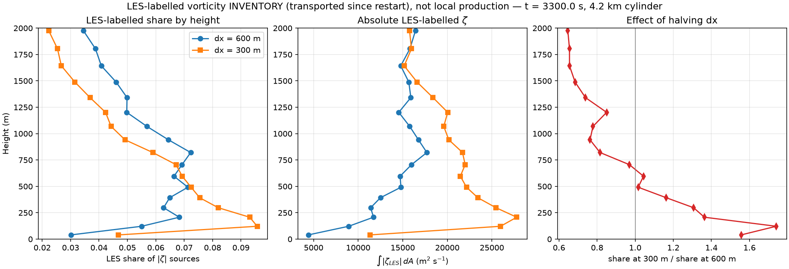
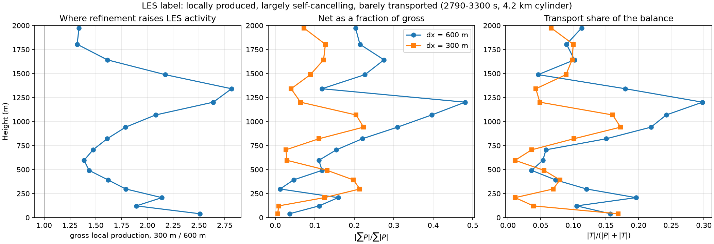

# Inventário de vorticidade rotulada LES por altura: 600 m contra 300 m

Data: 2026-09-13. Nenhuma simulação foi executada.

> **Este documento foi reescrito no mesmo dia, depois de uma auditoria do Codex
> (AGENT_CHANNEL, entre os Turnos 13 e 14) e de uma verificação independente
> minha.** A primeira versão continha quatro erros materiais, listados na secção
> «Correções». O padrão descritivo sobrevive; as conclusões causais não.

> **Desfecho, 2026-09-13 (mais tarde no mesmo dia).** A separação pedida pela
> auditoria foi feita — `scripts/les_local_vs_transported.py` — e **fecha esta
> linha contra a hipótese que a abriu**. Resumo na secção final; o essencial é
> que a atividade bruta do fecho cresce com o refinamento **em toda a coluna**,
> com o maior aumento a 1341 m (2,82×) e não junto ao solo (2,51×), e que a
> contribuição líquida é um resíduo pequeno de um termo que quase se cancela.
> Não há base para dizer que o fecho age preferencialmente junto ao solo.

## Resposta principal

Nas duas realizações existentes, o **inventário de ζ rotulado LES** é maior na
resolução de 300 m em quase todas as alturas, mas a razão é fortemente
dependente da altura: **2,57× a 39,9 m e 2,91× a 121,7 m, contra 0,96–1,06
acima de 1,5 km**. O inventário total cresce 1,47–1,62 junto ao solo e
1,19–1,23 em altura. Em consequência, a *quota* da LES sobe abaixo de ~600 m e
desce acima.

Isto é uma **diferença medida entre duas realizações**, não uma demonstração de
que o fecho deixou de convergir, nem de que o refinamento horizontal seja
inútil. As razões dessa diferença não foram isoladas.

Ponto metodológico que limita toda a leitura: o rótulo `les` da partição v4 é um
**inventário transportado desde o reinício**, não o termo LES local naquela
altura. Ele diz onde a vorticidade rotulada LES *está*, não onde o fecho *atua*.

## Correções à primeira versão

1. **«As duas corridas partem do mesmo estado; só dx muda» — falso.** A corrida
   de 300 m foi uma integração nova desde t = 0 a 240²
   (`run_diagnostic_sequence.py --nx 240 --capture-start 2790.25`, 8930 s de
   parede) e cada proveniência reinicia do estado da **sua própria**
   realização. São realizações independentes da mesma condição inicial
   analítica, já divergidas caoticamente.
2. **Números das integrais absolutas errados.** O script selecionava todas as
   saídas a menos de 40 s do instante final; o espaçamento é de 30 s, logo
   apanhava **dois** instantes por altura. Os valores publicados misturavam
   3270 e 3300 s. Corrigido: seleção pelo instante final exato de cada corrida.
3. **«Refinar remove o fecho em altura» — falso.** O que desce em altura é a
   *quota*. A integral absoluta rotulada LES **sobe** em quase todos os níveis
   (1,38 a 705,7 m; 1,01 a 1804,4 m) e só desce 4% no nível mais alto. A quota
   desce porque o denominador sobe mais.
4. **«A inversão dá-se entre 300 e 500 m, como no teste de parcelas» — falso.**
   No instante final a razão da quota é 1,044 a 596,1 m e 0,970 a 705,7 m: o
   cruzamento está entre 596 e 706 m. E depende da normalização — excluindo o
   estado antecedente, passa para entre 392 e 492 m. Não há fronteira única. A
   associação com a altura de regime do teste de parcelas está retirada: compara
   grandezas diferentes (altura final de parcelas em fase preparatória contra
   inventário euleriano em fase madura).
5. **«Não é o dt» — retirado como argumento.** Eu argumentei que um efeito de
   passo de tempo teria de ter o mesmo sinal a todas as alturas. Não existe tal
   restrição: mudar dt muda a trajetória, o acoplamento entre operadores e a
   exposição ao amortecimento aplicado por chamada, e a resposta pode variar de
   sinal com a altura. **O dt não está excluído.** Também não está demonstrado
   que explique o resultado.
6. **Figura inválida como perfil de um instante**, pelo mesmo defeito de seleção,
   e com erro de unidade no eixo — ∫|ζ|dA por nível é m² s⁻¹, não m³ s⁻¹.
   Regenerada.

## O par usado

| | 600 m | 300 m |
|---|---|---|
| proveniência | `outputs/vorticity_provenance_long_v4_2790_3300/` | `outputs/resolution_300m_provenance_20260909/` |
| realização de origem | `outputs/diagnostic_sequence_20260905/` (snapshot 93) | `outputs/resolution_300m_20260909/` (snapshot 0) |
| reinício | 2790,253490 s | 2790,579551 s |
| malha | 120 × 120 × 48 | 240 × 240 × 48 |
| passos na janela | 1015 (dt médio 0,502 s) | 1283 (dt médio 0,397 s) |
| parede, proveniência | 1978 s | 6194 s |
| parede, realização de origem | — | 8930 s (desde t = 0) |

A grade vertical é comum (`nz=48`, `z_stretch=1,05`, primeira célula 79,8 m); os
20 níveis do ficheiro são o recorte armazenado com halo, e este diagnóstico
integra os 17 níveis até cerca de 2 km. Máscara: cilindro de raio físico de
4,2 km centrado no vórtice rastreado de cada corrida, nível a nível.

A partição v4 é aditiva: a soma das nove fontes reproduz `omega_total` com erro
relativo máximo de **1,50e−14** (600 m: 9,36e−15). Isso valida a leitura e a
aditividade dos rótulos — não mede erro de truncamento, validade da LES nem
fechamento material físico.

## O que os números dizem, no instante final exato

| z (m) | quota 600 | quota 300 | razão quota | razão \|ζ_LES\| | razão \|ζ_total\| |
|---:|---:|---:|---:|---:|---:|
| 39,9 | 0,0301 | 0,0468 | 1,556 | **2,573** | 1,470 |
| 121,7 | 0,0550 | 0,0957 | 1,740 | **2,907** | 1,623 |
| 207,5 | 0,0683 | 0,0931 | 1,363 | 2,371 | 1,621 |
| 297,7 | 0,0628 | 0,0820 | 1,307 | 2,233 | 1,577 |
| 392,3 | 0,0649 | 0,0755 | 1,163 | 1,874 | 1,472 |
| 491,7 | 0,0713 | 0,0724 | 1,016 | 1,497 | 1,382 |
| 596,1 | 0,0664 | 0,0693 | 1,044 | 1,460 | 1,284 |
| 705,7 | 0,0692 | 0,0671 | 0,970 | 1,377 | 1,240 |
| 941,5 | 0,0644 | 0,0492 | 0,763 | 1,203 | 1,203 |
| 1341,4 | 0,0499 | 0,0368 | 0,739 | 1,156 | 1,231 |
| 1804,4 | 0,0387 | 0,0254 | 0,655 | 1,011 | 1,195 |
| 1974,4 | 0,0345 | 0,0223 | 0,646 | **0,960** | 1,192 |

Excluindo o estado antecedente `initial` do denominador — os dois braços herdam-no
de realizações diferentes — a razão da quota é 1,656 a 39,9 m, 1,670 a 121,7 m,
cruza 1,0 entre 392 e 492 m e desce a 0,522 a 1488 m.

O contraste sobrevive a mudanças do raio da máscara (2,4, 4,2 e 6 km, verificado
pelo Codex) e não aparece nas outras fontes: no nível mais baixo, sob o mesmo
refinamento, a quota do arrasto de superfície cai (0,93), a de Coriolis cai
(0,59) e a da projeção fica praticamente igual (0,95).

## O que não decorre destes dados

- Que a LES gere mais vorticidade localmente junto ao solo. O rótulo é
  transportado; um inventário maior pode vir de produção local, de transporte,
  de cancelamento entre rótulos ou de a região amostrada ter mudado.
- Que o método não convirja. A quota de proveniência não é uma norma de erro.
- Que o refinamento horizontal adicional seja inútil.
- Que a resolução vertical seja a causa, ou a única via de solução.
- Que o dt esteja excluído como confundidor.

O par mistura resolução, estado antecedente, passo de tempo e evolução do
escoamento. Mede sensibilidade; não isola causa.

## O próximo diagnóstico, e porque é este

Separar três coisas que o inventário agrega: **incremento LES local**,
**transporte do rótulo** e **crescimento do denominador**, em camadas físicas
comuns e com integrais assinadas e absolutas.

O material existe. Ambas as sequências — 600 m
(`outputs/diagnostic_sequence_20260905/`) e 300 m
(`outputs/resolution_300m_20260909/`) — guardam `increments/les` por intervalo,
que é o incremento de velocidade **efetivamente aplicado** pelo operador LES; o
seu rotacional é produção local, não rótulo transportado. As duas cobrem a mesma
janela 2790–3300 s. Custo: CPU, minutos. Nenhuma simulação.

Só depois disso a pergunta sobre a grade vertical fica bem posta.

## A corrida vertical proposta: porque não está pronta

A proposta da primeira versão — dx = 300 m, primeira célula de ~10 m em vez de
80 m — **não é uma mudança só de resolução vertical**:

- **Arrasto.** Com `use_log_law` ativo, `C_d = (κ/ln(z1/z0))²` depende da altura
  do primeiro centro. Mudar dz1 muda o coeficiente ao mesmo tempo que a malha.
  O código documenta-o e traz a mitigação: `drag.log_law_reference_height_m`
  fixa a altura de avaliação, de modo que todos os membros apliquem o mesmo C_d.
  Tem de ser usado.
- **Filtro LES.** `Δ = (dx·dy·mean(dz_c))^{1/3}` usa **um escalar global** com a
  média vertical da coluna. Acrescentar 10 níveis baixa Δ em cerca de 6% em todo
  o domínio, alterando o fecho em toda a parte. Não existe knob para isolar isto.
- **Remapeamento.** Uma grade vertical nova exige remapear o estado inicial, com
  verificação de conservação, divergência e ajuste da projeção.
- **Camadas de comparação.** Os novos centros não caem em 39,9–207,5 m; as
  camadas físicas comuns têm de ser definidas antes.

**Custo, agora medido e não estimado.** O `_dt` do solver usa máximos globais de
velocidade com o **dz mínimo global** — não é um CFL por célula. Avaliado no
campo maduro real de 300 m (|w|max 33,8 m/s, a 9370 m de altura, onde dz = 535 m;
|u|max 42,8; |v|max 42,7):

| grade | dt pela regra atual | dt por célula |
|---|---:|---:|
| atual, dz1 = 79,8 m | 0,339 s (corrida real: 0,397 s) | 1,017 s |
| proposta, dz1 = 10 m (nz 48→58) | **0,066 s** (0,19×) | 0,613 s |
| proposta, dz1 = 20 m (nz 48→54) | 0,122 s (0,36×) | 0,613 s |
| proposta, dz1 = 40 m (nz 48→50) | 0,213 s (0,63×) | 0,613 s |

Com a regra atual, dz1 = 10 m custa **cerca de 5,2× mais passos**. Reescalando os
tempos de parede reais, a integração desde t = 0 passaria de 2,5 h para da ordem
de **16 h**, e a proveniência de 1,7 h para cerca de **11 h** — total próximo de
**27 h**, não as 2,5–3,5 h que a primeira versão anunciou. Essa estimativa
estava errada por quase uma ordem de grandeza.

A tabela mostra também que o custo é um artefacto da regra: um CFL **por célula**
daria 0,613 s na grade fina contra 1,017 s na atual — um fator 0,60 em vez de
0,19. O |w| máximo ocorre a 9,4 km, onde dz = 535 m, e não tem nada a ver com as
células de 10 m junto ao solo. Tornar o CFL local seria a diferença entre ~27 h e
~3 h, mas é uma alteração do motor, teria de ser opt-in e validada, e muda o dt
de todas as corridas.

## Separação: produção local, transporte do rótulo, denominador

Feita em `scripts/les_local_vs_transported.py`. Usa `increments/les` — o
incremento de velocidade **efetivamente aplicado** pelo operador em cada
intervalo, cujo rotacional é produção local na célula onde aconteceu — contra a
variação do inventário v4 com a **mesma máscara nos dois instantes**, para que o
movimento da máscara não entre na diferença. O transporte é o resíduo.

A combinação é legítima porque as corridas de proveniência reproduzem o seu
controlo **bit a bit nos 12 campos prognósticos** (verificado em cada
`summary.json`, secção `neutrality`): as duas leituras descrevem a mesma
trajetória.

Somado na janela, por nível (m² s⁻¹):

| z (m) | prod. bruta 600 | 300 | razão | \|ΣP\|/Σ\|P\| 600 | 300 | quota transporte 600 | 300 |
|---:|---:|---:|---:|---:|---:|---:|---:|
| 39,9 | 6,86e3 | 1,72e4 | 2,51 | 0,036 | 0,006 | 0,16 | 0,17 |
| 121,7 | 5,38e4 | 1,02e5 | 1,89 | 0,111 | 0,009 | 0,11 | 0,04 |
| 297,7 | 4,68e4 | 8,38e4 | 1,79 | 0,012 | 0,214 | 0,12 | 0,07 |
| 596,1 | 5,67e4 | 7,86e4 | 1,39 | 0,110 | 0,030 | 0,05 | 0,01 |
| 1068,4 | 3,66e4 | 7,62e4 | 2,08 | 0,396 | 0,205 | 0,24 | 0,16 |
| **1341,4** | 2,20e4 | 6,19e4 | **2,82** | 0,118 | 0,040 | 0,18 | 0,04 |
| 1974,4 | 3,87e4 | 5,18e4 | 1,34 | 0,203 | 0,072 | 0,11 | 0,07 |

Três conclusões, e as duas primeiras favorecem o meu argumento original enquanto
a terceira o destrói:

1. **O transporte é um termo menor.** Quota mediana 0,113 a 600 m e 0,069 a
   300 m, máximo 0,30. O inventário maior junto ao solo é, de facto, produzido
   localmente — a explicação alternativa por transporte, levantada na auditoria,
   é mensurável e não se confirma.
2. **A produção local é maior a 300 m em todos os níveis**, entre 1,32× e 2,82×.
3. **Mas o maior aumento não é junto ao solo.** O pico está a 1341 m (2,82×) e
   1201 m (2,64×); o nível mais baixo dá 2,51× e o de 121,7 m apenas 1,89×.
   A afirmação «o fecho não converge *junto ao solo*» perde a sua base: a
   atividade cresce em toda a coluna, com máximo a meio.

E um quarto facto que enquadra tudo o resto: **a produção da LES quase se
cancela**. `|ΣP|/Σ|P|` fica entre 0,006 e 0,48, tipicamente 0,03–0,22. O efeito
líquido do fecho sobre ζ no cilindro é 1 a 20% da sua magnitude bruta — que é o
comportamento de um termo difusivo redistributivo. Junto ao solo o resíduo
líquido é tão pequeno que **muda de sinal entre as duas corridas**: −5,97e3 a
121,7 m em 600 m contra +8,87e2 em 300 m, e −6,72e3 contra +1,13e4 a 207,5 m.
Entre duas realizações independentes, isso é ruído sobre um cancelamento grande,
não um sinal.

**Conclusão da linha de investigação:** o contraste de inventário é real e é de
produção local, mas não sustenta que o fecho aja preferencialmente junto ao solo
nem que esteja a impedir a ligação à superfície. A corrida vertical proposta
perde a sua justificação e fica cancelada, não apenas suspensa.

Precisão: no par de 600 m, o emparelhamento entre os intervalos da sequência e
os da proveniência tem um desfasamento máximo de 0,576 s, ou 1,9% de um
intervalo de 30 s; quotas de transporte abaixo de ~0,02 estão no piso de
precisão. No par de 300 m o alinhamento é exato (0 s).

Nota deliberada: isto **não** é comparável com o resultado Lagrangiano de
`CONTROL_PARCEL_TEST.md`. Aquele é material, na janela 2370–2610 s, e este é
euleriano, em 2790–3300 s. Juntá-los seria repetir o erro de associação que a
auditoria assinalou.

## Artefactos

- `scripts/les_local_vs_transported.py` — a separação, a tabela e a figura.
- `outputs/les_local_vs_transported_20260913/` — CSV por nível e intervalo.
- `docs/media/storm/les_local_vs_transported.csv` — tabela condensada.
- `scripts/source_attribution_by_height.py` — a reanálise e a figura.
- `outputs/source_attribution_by_height_20260913/` — CSV por fonte, nível e
  instante, e o fecho da partição.
- `docs/media/storm/closure_share_by_height.csv` — tabela condensada, instante
  final exato, quotas com e sem o estado antecedente.
