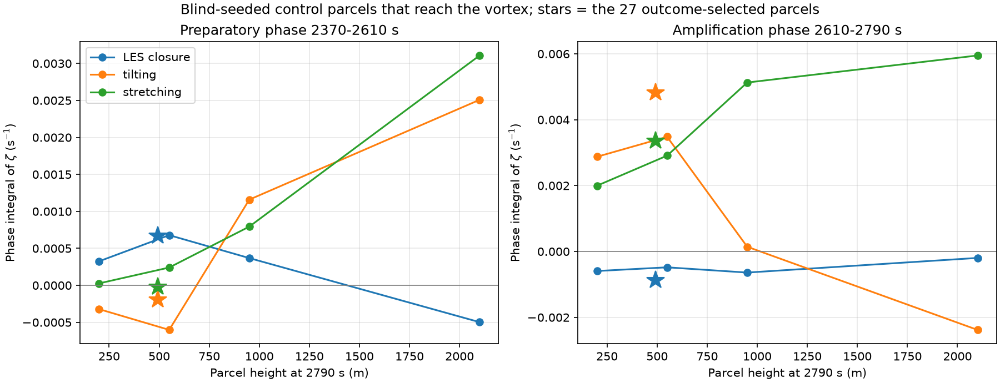

# Teste caso-controle da fase preparatória (2370–2610 s)

Data: 2026-09-12. Nenhuma simulação foi executada. Somente leitura de
`outputs/diagnostic_sequence_20260905/sequence.h5` e dos CSV de análise.

## Resposta principal

A dominância da LES na fase preparatória **é real e reproduz-se em parcelas
semeadas às cegas** — não era um artefacto da seleção pelo desfecho. Mas a
inferência que dela se tirava não se sustenta: essa assinatura pertence ao
**ramo baixo**, e o ramo baixo é o que menos contribui para a vorticidade
vertical do vórtice. O ar que fornece a maior parte de ζ prepara-se por
inclinação e estiramento resolvidos, com a LES negativa ou secundária.

Portanto a frase «a semente que a física resolvida amplifica foi criada pelo
fecho» está **retirada** enquanto afirmação sobre o vórtice. Vale apenas para
as parcelas que terminam abaixo de ~700 m.

## Porque era preciso um controle

As 27 parcelas publicadas foram semeadas **no** pico de 2790 s e integradas
para trás. Qualquer contagem do tipo «positivo em 27/27» está condicionada ao
desfecho. Faltava o grupo de comparação: ar do mesmo escoamento, escolhido sem
saber onde iria acabar.

Uma preocupação inicial ficou **descartada por medição**: as 27 parcelas não
são pseudo-réplicas. As sementes ocupam ±300 m em x,y e ±30 m em z numa malha
de 600 m, mas, integradas para trás, separam-se — 6,3 km (10,6 células) em
1800 s e 4,1–2,3 km na fase preparatória. A unanimidade é sobre parcelas
genuinamente distintas.

## Desenho

Regra de semeadura fixada por escrito antes de qualquer resultado ser
inspecionado (`scripts/control_parcel_test.py`, docstring):

- instante **1800,165633 s** (índice 60), o início da janela, integrando para a
  **frente** — a seleção não pode conhecer o desfecho;
- níveis `zc[1..3]` = 121,7, 207,5 e 297,7 m, que enquadram a faixa de alturas
  das 27 em 1800 s (cerca de 60 a 310 m);
- rede regular a cada 2 colunas (1200 m) com r ≤ 9 km do centróide do
  tratamento em 1800 s, e a cada 4 colunas para 9 < r ≤ 18 km;
- duas colunas excluídas em cada bordo, como faz o rastreador;
- nenhum filtro por ζ, ω_h, w ou flutuabilidade.

Essa execução pré-registada (864 parcelas) deixou apenas 10 parcelas na banda
de altura que interessava. Repetiu-se então **a mesma regra com mais amostra**,
sem alterar aquilo sobre o que se seleciona: todas as colunas até 10 km, a cada
3 até 16 km, e os níveis `zc[0..5]` (39,9 a 491,7 m) — 6.054 parcelas. É esta a
execução reportada; a esparsa fica no repositório para comparação.

O desfecho (ζ em 2790 s) é medido **depois** dos orçamentos e nunca entra na
seleção. As bandas de altura são um estratificador descritivo, aplicado a
posteriori.

Braços: `validate` (as posições do tratamento reamostradas por este código),
`retrace` (as posições do tratamento em 1800 s integradas para a frente) e
`control` (a rede acima). Execução de 67 s num processo de CPU — sem GPU, sem
WSL2 e sem integrar o modelo.

## Verificações antes de comparar

| Verificação | Resultado |
|---|---|
| Amostrador vs `analysis/lagrangian_budget.csv`, 18 grandezas × 27 parcelas × 35 intervalos | diferença máxima **exatamente 0,0** |
| Retraço: posições finais em 2850 s vs trajetória original | mediana **2,0e−6 m**, máximo 6,4e−6 m |
| Controle que atinge ζ ≥ 0,003 em 2790 s | 395 parcelas, todas a ≤ 5 km do centróide da componente rastreada |

A diferença nula significa que os números do controle e os do relatório de
formação vêm do mesmo amostrador; qualquer diferença entre eles é do ar, não do
código.

## Resultado

Medianas das integrais de fase de ζ (s⁻¹) e fração de parcelas com termo
positivo. Controle restrito às que atingem ζ ≥ 0,003 em 2790 s, estratificado
pela altura nesse instante.

### Fase 2370–2610 s (preparatória)

| grupo | n | Δζ | LES | inclinação | estiramento | quota da LES |
|---|---:|---:|---:|---:|---:|---:|
| **tratamento** (selecionado no pico, z≈492 m) | 27 | +0,000565 | **+0,000669 100%** | −0,000197 33% | −0,000022 33% | 0,44 |
| controle, z(2790) 0–400 m | 35 | +0,000243 | +0,000325 89% | −0,000322 40% | +0,000027 77% | 0,34 |
| **controle, z(2790) 400–700 m** | 98 | **+0,000602** | **+0,000679 88%** | −0,000602 39% | +0,000241 74% | 0,27 |
| controle, z(2790) 700–1200 m | 110 | +0,002351 | +0,000368 66% | +0,001159 81% | +0,000794 96% | 0,12 |
| controle, z(2790) 1200–3000 m | 151 | +0,005353 | −0,000498 18% | +0,002508 92% | +0,003107 100% | 0,10 |
| controle que **não** atinge o vórtice | 4088 | +0,000067 | −0,000014 42% | +0,000001 50% | +0,000051 90% | 0,13 |

### Fase 2610–2790 s (amplificação)

| grupo | n | Δζ | LES | inclinação | estiramento |
|---|---:|---:|---:|---:|---:|
| tratamento | 27 | +0,006426 | −0,000883 0% | +0,004829 100% | +0,003355 100% |
| controle 0–400 m | 35 | +0,003947 | −0,000593 20% | +0,002876 97% | +0,001997 94% |
| controle 400–700 m | 98 | +0,005213 | −0,000481 23% | +0,003481 86% | +0,002909 98% |
| controle 700–1200 m | 110 | +0,004687 | −0,000640 6% | +0,000143 53% | +0,005129 100% |
| controle 1200–3000 m | 110 | +0,001954 | −0,000196 11% | −0,002380 11% | +0,005950 100% |
| controle não-vórtice | 4034 | +0,000002 | −0,000005 45% | −0,000096 41% | +0,000075 87% |

## Leitura

**O tratamento é representativo — do seu estrato de altura.** A 492 m em
2790 s, o tratamento cai na banda 400–700 m, e o controle cego dessa banda
reproduz-o quase exatamente: LES +0,000679 contra +0,000669, Δζ +0,000602
contra +0,000565. Uma concordância a poucos por cento entre 27 parcelas
selecionadas pelo desfecho e 98 selecionadas às cegas é a confirmação mais
forte que este conjunto de dados podia dar de que a medição da LES está certa.

**A quota da LES decresce monotonicamente com a altura do desfecho**: 0,34 →
0,27 → 0,12 → 0,10. E o Δζ ganho na fase preparatória cresce monotonicamente na
direção oposta: +0,000243 → +0,000602 → +0,002351 → +0,005353. As parcelas cuja
preparação é conduzida pelo fecho são precisamente as que menos vorticidade
ganham; as que mais ganham preparam-se por inclinação e estiramento.

**A LES não é uma fonte genérica de ζ no escoamento.** Nas 4.088 parcelas de
controle que não atingem o vórtice, a LES é positiva em 42% e a mediana é
−1,4e−5, ou seja, nula na prática. Não há produção sistemática de ζ pelo fecho.

**O método discrimina.** As parcelas que terminam anticiclónicas mostram a
imagem espelhada — inclinação positiva em apenas 23% e Δζ negativo. O
diagnóstico não confirma tudo o que lhe é dado.

**A inclinação 27/27 da fase 3 também é do estrato, não da seleção.** Reproduz-se
em 0–700 m (97% e 86%) e desaparece acima (53% e 11%, onde domina o
estiramento).

## O que isto muda e o que não muda

Muda: a fase preparatória do vórtice **não** é conduzida pelo fecho subgrid. É
conduzida por inclinação e estiramento resolvidos, no ar que fornece a maior
parte de ζ. A LES conduz um ramo baixo, fraco e minoritário.

Não muda: continua por explicar porque é que, especificamente abaixo de 700 m,
o incremento do fecho é positivo e a inclinação resolvida é negativa. Esse
contraste é agora um facto medido em 133 parcelas cegas, não uma suspeita. É
uma pergunta sobre a camada superficial — onde atuam a divergência de tensão e
a lei logarítmica — e não sobre a génese do vórtice.

Também não muda o teste de convergência: saber se a quota de 0,27–0,34 do ramo
baixo encolhe com o refinamento continua por responder, e a corrida de 300 m
cobre apenas 2790–3300 s, sem alcançar esta janela.

## Limitações

- A estratificação por altura é a posteriori; não é um braço aleatorizado.
- A quadratura no ponto médio e os 43,57% de diferença entre o rotacional
  advectivo aplicado e a forma contínua aplicam-se aqui tal como no relatório
  de formação: limitam a atribuição entre inclinação e estiramento, não o sinal
  da LES, que é lido do incremento do próprio operador.
- Parcelas que passam de 2000 m saem do volume de orçamento e são inválidas
  nesse intervalo; por isso a banda 1200–3000 m tem 151 parcelas na fase 2 e
  110 na fase 3.
- A execução pré-registada esparsa (`outputs/control_parcels_20260912/`) tinha
  apenas 10 parcelas na banda 400–700 m e dava a inclinação com o sinal oposto
  (+0,000555). A execução adensada, na mesma regra, tem 98 e inverte-o
  (−0,000602). Reporta-se o adensado; o esparso fica no repositório.

## Artefactos

- `scripts/control_parcel_test.py` — o teste; a regra de semeadura está na
  docstring.
- `scripts/control_parcel_report.py` — tabela estratificada e figura.
- `outputs/control_parcels_20260912/` — execução pré-registada esparsa.
- `outputs/control_parcels_20260912_dense/` — execução adensada, a reportada.
