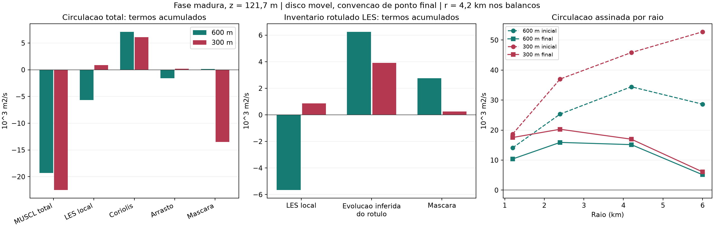

# Tornadogênese: balanço discreto na fase madura

Data: 2026-09-15, continuação posterior à auditoria de cancelamento.
Nenhuma simulação foi executada; física e arquivos de origem foram preservados.

## 1. Conclusão científica atual

O déficit de concentração/alinhamento, acompanhado de perda de circulação,
continua descrevendo o caso. O avanço é localizar essa perda na contabilidade
dos operadores e na distribuição radial, sem identificar contabilidade com causa.

No disco de 4,2 km a 121,7 m, o estágio MUSCL total tem incremento de circulação
negativo em todos os nove blocos coincidentes, nas duas grades. O sinal persiste
com máscara móvel em duas convenções e com disco fixo no centro inicial.
A injeção local LES não explica sozinha o comportamento comum: sua integral
no disco móvel é negativa em 600 m e positiva em 300 m. O inventário LES
nesse disco cresce nos dois casos, com contribuição da evolução do rótulo e
da seleção espacial pela máscara.

Esse é um mecanismo numérico identificado no balanço: a atualização advectiva
do momento participa sistematicamente da perda de circulação nessa região.
Ainda não se separaram o transporte físico, a deformação do campo e os efeitos
do esquema limitado. Não é uma demonstração de que o MUSCL cause a ausência
de tornado, nem de que a LES seja irrelevante para a trajetória.

Todas as observações novas são dos campos simulados. Não foi acrescentada
validação com radar ou outra observação meteorológica independente.

## 2. Balanço, dados e verificações

Definições anteriores ao cálculo: [método](LES_DISCRETE_BALANCE_METHOD.md).
Para o rótulo LES, q=C U_LES e L=C sum(delta U_LES local). Em cada bloco:

`A = q_b - q_a - L`

`I(M_b,q_b) - I(M_a,q_a) = I(M_b,L) + I(M_b,A) + I(M_b-M_a,q_a)`

Os campos q,L,A têm s^-1; suas integrais horizontais e o termo de máscara
têm m²/s. São incrementos acumulados, não taxas em m²/s². O centro do disco
é o do rastreador de baixo nível em toda a coluna; ele não acompanha o eixo
individualmente em cada altura. Foram usados 17 níveis e quatro raios físicos.

A é chamado **evolução inferida do rótulo sob MUSCL**, pois o código v4 só
injeta nesse rótulo no estágio LES e o atualiza no estágio advectivo. A não
é fluxo de zeta medido independentemente. A inferência combina a versão
verificada do tracer, os gates arquivados e a consistência dos campos nas pontas.
Os incrementos LES do próprio replay não estão salvos separadamente no arquivo
de proveniência: a identidade da injeção com a sequência original não tem uma
segunda medição independente. A igualdade de zeta não deve ser anunciada como
comparação dos 12 prognósticos entre replay e arquivo original. A neutralidade
bit a bit dos 12 campos arquivada é entre replay observado e seu controle.

Foram encontrados dez estados de 600 m exatamente coincidentes com a sequência
original. Agregando incrementos entre eles, os nove blocos cobrem toda a janela
2790,253490–3300,023494 s sem lacunas. Em 300 m, todos os 18 estados coincidem;
usaram-se os mesmos índices de agrupamento, 2790,579551–3300,023494 s. Não se
interpolou nenhum campo. A diferença máxima entre pontas dos dois casos é
0,506336 s: são janelas nominais comparáveis, não a mesma trajetória nem uma
estimativa de erro. A coincidência interna de cada caso é exata.

| Verificação nova | 600 m | 300 m |
|---|---:|---:|
| diferença máxima de zeta, arquivo versus replay, nas pontas usadas (s^-1) | 0 | 0 |
| fechamento RMS relativo da soma dos operadores totais | 8,07e-15 | 5,65e-15 |
| erro máximo da identidade de máscara (m²/s) | 3,72e-10 | 4,71e-10 |
| erro máximo integral do rotacional versus soma por partes (m²/s) | 3,64e-11 | 6,09e-11 |

O hash do tracer de 300 m coincide com o atual. O de 600 m foi reproduzido
exatamente revertendo **em memória** apenas a correção documentada do contador
de passo em `close()`. Nenhum código foi revertido em disco. A primeira tentativa
parou nesse gate; o processamento só prosseguiu depois dessa verificação.

Cinco testes analíticos passaram: rotação sólida, soma por partes incluindo
bordas externas, duas convenções de máscara e campo estacionário com máscara
móvel. O pós-processamento dos campos levou 48,7 s. Não se repetiram as
simulações, os gates completos de proveniência ou a análise geométrica anterior.

## 3. Resultados novos

### Circulação total e rótulo LES

Acumulado na janela, z=121,7 m, raio 4,2 km, máscara móvel avaliada na ponta
final de cada bloco. Valores em m²/s, arredondados:

| Circulação total: termo | 600 m | 300 m |
|---|---:|---:|
| estágio MUSCL total | -19.312 | -22.516 |
| LES local | -5.667 | +869 |
| Coriolis | +7.103 | +6.087 |
| arrasto de superfície | -1.563 | +215 |
| mudança de máscara | +162 | -13.513 |
| mudança total observada | **-19.277** | **-28.857** |

Os demais estágios somam zero à precisão numérica nessa integral vertical de
rotacional. Isso não implica ausência de efeitos indiretos: projeção e
flutuabilidade podem alterar o escoamento que alimenta estágios posteriores.
O arrasto com integral positiva em 300 m não significa produção de energia;
circulação assinada e dissipação de energia são grandezas diferentes.

| Inventário LES: termo | 600 m | 300 m |
|---|---:|---:|
| injeção local P | -5.667 | +869 |
| evolução inferida do rótulo H | +6.254 | +3.911 |
| mudança de máscara S | +2.756 | +257 |
| mudança do inventário rotulado | **+3.342** | **+5.037** |

Em 600 m, o inventário rotulado positivo final não pode ser explicado pela
integral local assinada, que é negativa nessa convenção. Em 300 m, H também
é maior que P em magnitude líquida. Essas somas substituem a afirmação antiga
de que o inventário foi demonstrado ser de origem local; não dão porcentagens
causais e não fazem de H uma medida de exportação/importação através do cilindro.

### Efeito da máscara e robustez

Na convenção simétrica, o termo MUSCL total é -20.877 e -22.831 m²/s;
a máscara contribui +1.875 e -12.556 m²/s. Em disco fixo de 4,2 km,
MUSCL total é -29.728 e -34.531 m²/s e a máscara, por definição, zero.
O sinal negativo de MUSCL persiste em 9/9 blocos em todas essas convenções.
O disco fixo amostra uma região diferente após o vórtice se deslocar cerca de
3 km; ele é um controle da definição espacial, não a mesma parcela de ar.

No raio de 1,2 km, a separação é muito mais dependente da convenção: em 600 m,
MUSCL total passa de +2.474 (ponta final) a -4.330 m²/s (simétrica), enquanto
a soma com a máscara preserva a mudança observada. Portanto, atribuições de
sinal dentro do núcleo usando apenas máscaras finais e blocos longos não são
robustas. Também não se generaliza o resultado de 4,2 km para qualquer raio:
no disco fixo de 6 km, MUSCL total tem soma positiva nos dois casos.

### Módulos e cancelamentos

No mesmo disco móvel de 4,2 km e nível, os três agregados são distintos:

| caso / termo | soma assinada | soma dos módulos das integrais por bloco | soma dos módulos espaciais por bloco |
|---|---:|---:|---:|
| 600 m / LES local | -5.667 | 6.372 | 50.348 |
| 600 m / evolução do rótulo | +6.254 | 7.941 | 54.311 |
| 300 m / LES local | +869 | 4.675 | 95.706 |
| 300 m / evolução do rótulo | +3.911 | 10.102 | 116.826 |

Todos em m²/s. A redução da terceira para a segunda coluna numérica mede
cancelamento espacial de cada bloco; da segunda para o módulo da primeira,
cancelamento temporal entre blocos. Os campos de cada bloco ainda contêm
cancelamento entre passos nativos. A evolução do rótulo não é pequena diante
da injeção local por essas normas. Não comparar estes módulos com os antigos
blocos de 30 s como se a cadência e as máscaras fossem idênticas.

### Circulação radial, alinhamento e sincronização

| região, a 121,7 m | mudança 600 m (m²/s) | mudança 300 m (m²/s) |
|---|---:|---:|
| disco até 1,2 km | -3.721 | -1.153 |
| anel de 1,2 a 4,2 km | -15.556 | -27.704 |
| disco até 4,2 km | -19.277 | -28.857 |

A perda é maior no anel externo. Em 300 m, sua circulação assinada final é
-560 m²/s: sinais opostos se compensam, portanto a razão Gamma(1,2)/Gamma(4,2)
pode ultrapassar 1 e não é uma fração de circulação positiva. Não se mediu aqui
exportação de vorticidade nem remoção de vorticidade absoluta.

A LES local somada no disco móvel de 1,2 km é positiva nos dois casos
(+1.936 e +4.734 m²/s), assim como no disco de 2,4 km (+4.601 e +7.925).
Isso enfraquece a hipótese de um sumidouro LES assinado uniforme em todo o núcleo;
não exclui redução do pico de zeta ou dissipação de energia por LES.

As séries existentes mostram que, em 300 m, a largura à meia amplitude cai de
1173 para 957 m e o deslocamento do eixo entre baixo nível e 2 km cai de
4638 para 1264 m entre as pontas. Zeta máxima cai de 0,02082 para 0,01446 s^-1.
Há um pico intermediário de deslocamento de 7011 m; a melhora não é monótona.
Em 600 m, a largura inicial/final permanece 2245 m, o deslocamento do eixo cai
de 2164 para 1413 m e zeta final é 29,7% menor que seu pico na janela.

Logo, o déficit de concentração/alinhamento permanece relativo à estrutura
tornádica buscada, mas **enfraquecer não equivale a alargar continuamente ou
desalinhar progressivamente**. A perda de circulação periférica ocorre mesmo
com estreitamento e melhora de alinhamento entre as pontas em 300 m.

Em 600 m, o máximo de convergência sucede o de zeta em 239,96 s. Em 300 m,
ambos estão no primeiro estado disponível: a diferença tabulada é zero, mas
o pico anterior não foi observado, impedindo afirmar sincronização da gênese.
As correlações espaciais medianas zeta/convergência na janela são -0,0446 e
-0,0284. São associações no campo, sem inferência causal ou significância de ensemble.

## 4. Hipóteses e limites causais

| hipótese | estado após esta etapa |
|---|---|
| perda de circulação mediada pelo estágio advectivo no disco de 4,2 km | fortalecida como atribuição numérica; sinal robusto nos nove blocos |
| LES local explica sozinha o inventário LES final | enfraquecida; P,H,S contribuem de maneiras distintas |
| LES remove circulação assinada uniformemente no núcleo | enfraquecida nos discos de 1,2 e 2,4 km; não exclui efeito sobre pico/energia |
| movimento da região amostrada é desprezível | enfraquecida, especialmente em 300 m e em discos pequenos |
| exportação física versus deformação versus efeito do limitador MUSCL | ainda indistinguíveis pelos fluxos salvos |
| causa da ausência de tornado é LES, cold pool, topo ou discretização | não determinada; exige controles adicionais |
| história inicial e mecanismo de formação antes de 2790 s | não identificados por este balanço maduro |

O fechamento confirma contabilidade. Dois casos com dx, trajetórias e exposição
ao damping por passo diferentes não estabelecem convergência espacial. O sinal
de um operador pode mudar com máscara, raio e resolução; não foi chamado ruído.
O rótulo `initial` continua agregando a história anterior ao reinício. Não se
usaram parcelas da fase preparatória para explicar as somas da fase madura.

## 5. O que falta e próximo passo mínimo

**Recuperável agora:** injeção local acumulada; mudança do rótulo nas pontas;
efeito da máscara; soma por partes do rotacional de incrementos LES e de todos
os operadores totais; sensibilidade a raio/convenção. Os dados permitiram os
nove blocos coincidentes também em 600 m, sem captura nova.

**Não recuperável independentemente:** velocidades rotuladas durante os passos,
fluxos MUSCL de momento por direção e face, incrementos advectivos do rótulo
medidos diretamente, módulos antes do cancelamento intrabloco e injeções LES
do replay para comparação direta com as originais. Salvar apenas vorticidade
em dois instantes não determina esses fluxos. A soma por partes já verificada
é uma borda do operador rotacional, não o fluxo advectivo de zeta.

**Proposta mínima, não executada:** captura passiva em replay do caso de 600 m
na mesma janela 2790,253490–3300,023494 s, reiniciando do snapshot 93 com os
1015 dt arquivados e a mesma física. A janela completa é necessária para cobrir
o pico de zeta, o atraso da convergência e o enfraquecimento; um trecho de 30 s
serviria só para validar instrumentação. Não é o refinamento vertical cancelado.

Na captura proposta, para as velocidades horizontais total e rotulada LES:

- registrar diretamente os incrementos LES e MUSCL por passo;
- projetar os fluxos de momento MUSCL nas direções x,y,z com os pesos adjuntos
  do rotacional e da máscara; usar a geometria escalonada nativa e registrar
  separadamente qualquer tratamento de fronteira;
- guardar somas assinadas e módulos antes de acumular no tempo, nos mesmos
  discos, níveis e convenções; os pesos das máscaras podem ser pré-calculados
  da trajetória arquivada, desde que a reprodução dessa trajetória seja validada;
- comparar os 12 prognósticos com os snapshots originais disponíveis e comparar
  observador ativo/inativo; registrar hashes dos incrementos LES e da agenda.

Critérios: neutralidade bit a bit; reconstrução do incremento advectivo diretamente
a partir dos fluxos e fechamento do balanço do rótulo até 1e-10 relativo,
com escala absoluta publicada para termos quase nulos; soma da máscara exata;
persistência do sinal em raios 2,4 e 4,2 km e nas duas convenções de máscara.
Se a soma por direções reconstruir H, a atribuição deixa de depender apenas da
subtração. Se falhar, revisar a instrumentação antes de interpretar. Se houver
reversão de sinal com convenção/cadência, classificá-la como não robusta.
Mesmo com sucesso, direções de fluxo de **momento** não equivalem automaticamente
a transporte/tilting/stretching físicos de vorticidade; essa ponte exige derivação
discreta própria. Não combinar as duas decomposições em uma única soma.

Custo de referência: a proveniência de 600 m com controle levou 1981 s,
cerca de 33 min para 1015 passos. Reservar 40–60 min é uma estimativa operacional
com overhead ainda não medido. Projeções escalares por passo podem manter a
captura na ordem de 5–50 MB, dependendo do número de máscaras/diagnósticos;
salvar os fluxos espaciais integrados exigiria aproximadamente 0,5–1 GB em
float64 para 20 níveis e 18 saídas. São estimativas, não benchmarks novos.
O segundo replay de 300 m não é necessário ao primeiro teste; sua referência
seria 6200 s, cerca de 103 min, antes do overhead adicional.

Essa captura discrimina mecanismos de contabilidade na trajetória existente.
Uma alegação causal física ainda exigirá um experimento controlado específico
ou demonstração de robustez numérica; nenhum foi autorizado ou iniciado aqui.

## Auditoria documental e artefatos

Conclusões anteriores conferidas em scripts, metadados e tabelas:

- `outputs/resolution_comparison_20260909/summary.json`: sensibilidade 300/600,
  com núcleo marginal e damping dependente de dt. Seus 18 tempos incluem 3300
  e 3300,023494 s, quase duplicados, e não incluem 2790; são amostras escalares,
  não 18 realizações independentes. As medianas desta etapa usam a série nativa
  quando explicitado e não substituem silenciosamente aquelas medianas.
- `outputs/domain_extent_120km_comparison_20260910/summary.json`: zero métricas
  materialmente favoráveis e `no dominant favorable domain effect`, preservado.
- `outputs/top_boundary_hightop20_20260911/metadata.json`: aborto por CFL em
  1287,331589 s, zero quadros; controle de 15 km completo. Topo inconclusivo.
- `scripts/source_attribution_by_height.py`: a docstring ainda diz mesmo estado
  e apenas dx diferente; isso contradiz os metadados e a correção de 13/09.
- `scripts/les_local_vs_transported.py`: ainda nomeia todo R como transporte.
  A definição não demonstra fluxo e foi substituída pelo balanço desta etapa.
- `docs/CLOSURE_CONVERGENCE_BY_HEIGHT.md`: as frases históricas que excluem
  transporte, chamam mudança de sinal de ruído e deduzem piso de erro de 2%
  permanecem preservadas, mas estão explicitamente substituídas pelas correções.
- `docs/TORNADOGENESIS_ANALYSIS_CONTINUITY.md`: a alegação histórica de que o
  desfasamento só afeta sobreposições com pressão/termodinâmica não se aplica
  à subtração de injeções e inventário no script de 13/09. Aqui a lacuna temporal
  foi eliminada agregando blocos coincidentes.

Scripts e saídas novos:

Um conjunto compacto para consulta no remoto está em
`docs/media/storm/les_discrete_balance_20260915/`: resumo dos gates,
termos por altura, circulação radial e figura. Os arquivos HDF5 e as saídas
completas regeneráveis permanecem locais, conforme a convenção do repositório.

- `scripts/analyze_les_discrete_balance.py`;
- `tests/test_les_discrete_balance.py`;
- `outputs/les_discrete_balance_20260915_v2/`: `summary.json`,
  `terms_by_block.csv`, `terms_by_height.csv`, `balances_by_block.csv`, `manifest.json`;
- `scripts/summarize_les_discrete_balance.py`;
- `outputs/les_discrete_balance_synthesis_20260915/`: síntese JSON,
  `radial_circulation.csv`, figura e manifesto;
- `outputs/les_discrete_balance_20260915/attempt_status.json`: primeira tentativa
  interrompida antes do processamento de campos, sem artefatos científicos.

Entradas HDF5: `outputs/diagnostic_sequence_20260905/sequence.h5`,
`outputs/vorticity_provenance_long_v4_2790_3300/provenance_long_v4.h5`,
`outputs/resolution_300m_20260909/sequence.h5` e
`outputs/resolution_300m_provenance_20260909/provenance_long_v4.h5`.
Centros e métricas: `vortex_timeseries.csv` em
`outputs/resolution_600m_comparison_audit_20260909/` e
`outputs/resolution_300m_audit_20260909/`.

O manifesto inclui hashes dos scripts, produtos e seleções HDF5 efetivamente
lidas, com caminhos, formas, tipos, seleções, tamanho e mtime dos arquivos.
Hashes integrais HDF5 antigos são identificados como arquivados, não recalculados.
O processamento verificou que tamanho e mtime dos arquivos de entrada não mudaram.
