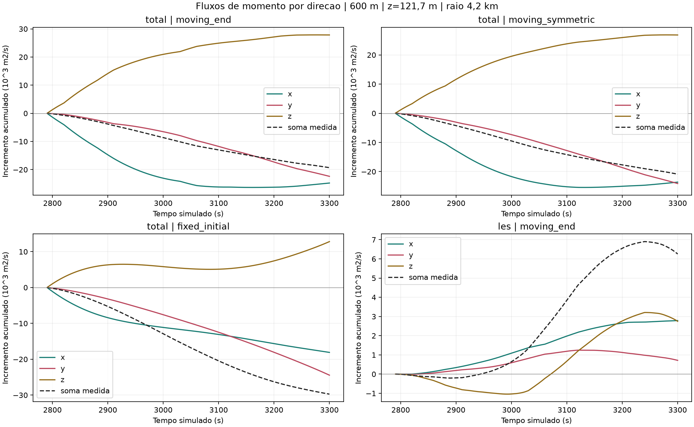

# Captura direta MUSCL: fase madura de 600 m

Data: 2026-09-20. Escopo: replay diagnostico autorizado no prompt anexado,
snapshot 93, 1015 passos arquivados, 2790,253490--3300,023494 s.

## Estado da verificacao

O piloto de 69 passos e a janela completa de 1015 passos passaram. Foram
reproduzidos bit a bit os 12 prognosticos nos 18 snapshots originais disponiveis,
incluindo o inicial. O observador ativo/inativo foi neutro bit a bit em cada
passo. Tempo medido: 1285,99 s (21,43 min); HDF5 novo: 46.422.995 bytes
(44,27 MiB), abaixo da estimativa bruta de 63,61 MiB.

**Resposta principal:** em z=121,6591 m e raio 4,2 km, o MUSCL total contribui
negativamente nos 1015 passos, nas tres convencoes de mascara. Na integral
acumulada, x e y sao negativos e z compensa parte da perda. A evolucao direta
do rotulo LES confirma a antiga inferencia por diferenca para este replay de
600 m. Isso fortalece a atribuicao numerica, nao identifica ainda a causa
fisica do enfraquecimento nem demonstra dissipacao artificial.

## Pergunta e metodo

Esta etapa pergunta se a contribuicao atribuida ao MUSCL e a evolucao do
rotulo LES podem ser reconstruidas dos fluxos discretos de momento. Nao e
uma intervencao na fisica nem um teste de convergencia.

Para cada direcao a=x,y,z e componente i=u,v, F[a,i] tem unidade m2/s2.
O incremento de velocidade e dU[a]=-dt D[a]F[a], em m/s. O rotacional
discreto C, com as interpolacoes C-grid nativas, produz dq=C dU, em s^-1.
A integral I(M,dq)=dx dy sum(M dq), num nivel horizontal, tem m2/s.
Nao ha integracao vertical nesta grandeza.

Em cada passo, sao medidos os incrementos efetivos antes/depois dos estagios:

- total: dq=C(dU_LES+dU_MUSCL+dU_outros);
- rotulo LES: dq_LES=C(dU_injecao+dU_MUSCL_LES).

Outros e a soma direta dos demais estagios, nao o residuo de inventarios.
O cancelamento entre esses estagios agrupados ainda permanece.

Os fluxos sao recalculados pelas mesmas rotinas nativas no estado anterior
imutavel. Comparam-se sua divergencia e a tendencia nativa, depois a mudanca
efetiva com fl(U+dt*tendencia)-U. O resto efetivo menos as tres direcoes e
registrado como arredondamento. Isso verifica a reconstrucao e a neutralidade,
mas nao constitui uma validacao independente da formula numerica do solver.

A identidade adjunta usa dx dy sum[(D_x^T M) dv_c-(D_y^T M) du_c], com o
tratamento original das bordas. Ela e uma soma por partes do rotacional do
incremento, nao uma medicao independente de fluxo fisico de vorticidade.
Os fechamentos periodicos e as paredes verticais entram nas diferencas
nativas; os fluxos verticais nas duas paredes sao verificados como nulos.

## Regioes, mascaras e cancelamentos

Sao preservados 17 niveis ate 2 km e os raios 1,2; 2,4; 4,2; 6 km. Os pesos
ficam fixos dentro de cada um dos nove blocos arquivados. Nao foi inventada
uma trajetoria do centro em cada passo nativo.

Na convencao de ponta final:

`I(Mb,qb)-I(Ma,qa) = I(Mb,qb-qa)+I(Mb-Ma,qa)`.

Na convencao simetrica, substituir Mb no primeiro termo por (Ma+Mb)/2 e qa
no segundo por (qa+qb)/2. Na mascara fixa inicial, Ma=Mb e o segundo termo
e zero. A mudanca de mascara e contabilizada separadamente em ambos os casos.

Cada termo tem soma assinada, soma dos modulos das integrais por passo,
soma das integrais dos modulos espaciais por passo e os correspondentes
agregados por bloco. Razoes entre essas quantidades medem cancelamento,
nao porcentagens causais. Os nove blocos nao sao realizacoes independentes.
Nos aneis concentricos, as integrais assinadas e dos modulos espaciais sao
obtidas pela diferenca das integrais dos discos aninhados; o modulo da
integral anular e calculado depois da subtracao, nunca subtraindo modulos
de integrais assinadas.

## Artefatos e proveniencia

- Observador: `src/storm_dynamics/muscl_capture.py`.
- Executor: `scripts/run_muscl_direct_capture.py`.
- Pos-processamento: `scripts/analyze_muscl_direct_capture.py`.
- Testes: `tests/test_muscl_capture_observer.py` e
  `tests/test_momentum_flux_capture.py`.
- Captura local: `outputs/muscl_direct_capture_20260920/`.
- Analise local: `outputs/muscl_direct_analysis_20260920/`.
- Copia compacta compartilhavel: `docs/media/storm/muscl_direct_20260920/`.
- Protocolo: [MUSCL_DIRECT_CAPTURE_PROTOCOL.md](MUSCL_DIRECT_CAPTURE_PROTOCOL.md).

Os manifestos registram hashes de codigo, agenda, entradas consumidas e
artefatos. Os campos arquivados originais nao sao sobrescritos. A captura
salva estatisticas escalares, nao novos campos completos de tempestade.

## Verificacoes concluidas

Todos os gates mantiveram a tolerancia relativa previamente definida de
1e-10. O erro relativo usa RMS e piso de 1e-12 m/s ou s^-1 nos campos;
para integrais, o piso e 1 m2/s. O erro absoluto abaixo e o maximo pontual,
nao o numerador RMS da razao.

| Verificacao | Maior erro relativo | Maior erro absoluto |
|---|---:|---:|
| Reconstrucao de fluxos total, u/v | 1,91e-16 | 1,18e-16 m/s |
| Reconstrucao de fluxos LES, u/v | 1,51e-16 | 1,39e-17 m/s |
| Atualizacao efetiva versus soma arredondada, total/LES | 0 | 0 m/s |
| Fechamento por passo, total | 5,58e-13 | 1,33e-17 s^-1 |
| Fechamento por passo, LES | 8,66e-14 | 2,64e-18 s^-1 |
| Integral do rotacional versus adjunto | 3,72e-15 | 5,82e-11 m2/s |
| Balanco com movimento de mascara, total | 6,75e-15 | 8,37e-11 m2/s |
| Balanco com movimento de mascara, LES | 1,99e-15 | 7,28e-12 m2/s |
| Evolucao LES direta versus inferida anteriormente | 1,06e-15 | 5,46e-12 m2/s |

Os campos total e LES nos nove finais de bloco coincidem bit a bit com a
proveniencia anterior. A maior diferenca entre todos os termos escalares
comparados com a auditoria anterior foi 2,91e-11 m2/s. A agenda arquivada foi
preservada; nao houve ajuste de tolerancias. Tres testes do observador,
incluindo integracao CPU/GPU, passaram; os oito testes das saidas opcionais
de fluxo tambem passaram. O primeiro teste integrado que falhou e sua
correcao de contabilidade de arredondamento estao descritos no protocolo.

## Resultados por direcao e regiao

Todos os valores seguintes sao incrementos acumulados de circulacao em m2/s,
na janela completa e em z=121,6591 m. Direcoes sao eixos da malha, nao radial
e azimutal. A soma MUSCL inclui o arredondamento medido.

| Raio e mascara | x | y | z | MUSCL total |
|---|---:|---:|---:|---:|
| 1,2 km, ponta final | -7.535,81 | +27.367,75 | -17.357,81 | +2.474,12 |
| 2,4 km, ponta final | -1.568,23 | +1.057,68 | -17.941,46 | -18.452,01 |
| 4,2 km, ponta final | -24.769,69 | -22.388,27 | +27.846,31 | -19.311,65 |
| 6 km, ponta final | -19.454,65 | -15.743,24 | +26.054,92 | -9.142,97 |
| 4,2 km, simetrica | -23.615,10 | -24.098,47 | +26.836,76 | -20.876,81 |
| 4,2 km, fixa inicial | -18.092,79 | -24.441,43 | +12.805,82 | -29.728,39 |

O sinal total em 4,2 km e negativo nos 1015 passos nas tres convencoes;
o mesmo ocorre em 2,4 km. Em 1,2 km, a mascara simetrica produz -4.329,62
e a fixa -19.448,71, contrastando com a ponta final positiva. Em 6 km, a
fixa produz +8.891,23, positiva em todos os passos, enquanto as duas moveis
tem soma negativa. Isso impede uma generalizacao de perda uniforme no dominio.

Na ponta final, anel 1,2--4,2 km: x=-17.233,87; y=-49.756,01;
z=+45.204,12; soma=-21.785,77. Anel 4,2--6 km: x=+5.315,03;
y=+6.645,03; z=-1.791,39; soma=+10.168,67. Sao contribuicoes do operador,
nao uma prova de transferencia conservativa entre esses dois aneis.

Em 4,2 km, ponta final, a soma MUSCL e negativa nos 13 niveis inferiores,
ate 1341,45 m; nos quatro niveis a partir de 1488,29 m a soma e positiva. Entre
39,89 e 1201,59 m todos os passos sao negativos; em 1341,45 m sao 814.
Logo, nem mesmo esse disco sustenta uma perda assinada em toda a coluna.

## LES local, evolucao do rotulo e mascara

Para 4,2 km e ponta final, em m2/s:

| Parcela | Circulacao total | Inventario do rotulo LES |
|---|---:|---:|
| Incremento/injecao local LES | -5.667,45 | -5.667,45 |
| MUSCL efetivamente medido | -19.311,65 | +6.254,03 |
| Outros estagios, somados diretamente | +5.540,32 | nao se aplica |
| Movimento da mascara | +161,73 | +2.755,61 |
| Mudanca de inventario | -19.277,04 | +3.342,19 |

No rotulo LES, x=+2.787,79; y=+716,76; z=+2.749,48. A soma direta
+6.254,027430803442 confirma a antiga inferencia +6.254,027430803443.
O arredondamento acumulado e +2,70e-11 no total e -1,80e-13 no rotulo LES.
Essas medidas substituem a pendencia de reconstrucao direta para 600 m;
nao convertem o antigo residuo R=delta I-P em fluxo fisico de fronteira.

Na convencao simetrica, o movimento da mascara vale +1.875,10 para o total
e +3.237,87 para LES; as mudancas de inventario sao as mesmas das pontas
moveis. A reparticao interna muda, como exige a identidade exata. Na mascara
fixa o movimento e zero, mas a regiao fisica amostrada e outra.

## Cancelamento e cadencia

Em 4,2 km, ponta final, todas as grandezas abaixo tem m2/s. A soma dos
modulos das integrais por passo e distinta da integral do modulo espacial.

| Termo | Soma assinada | Soma modulo integral/passo | Soma modulo espacial/passo | Soma modulo espacial/bloco |
|---|---:|---:|---:|---:|
| MUSCL total | -19.311,65 | 19.311,65 | 174.054,60 | 166.496,02 |
| LES local | -5.667,45 | 6.427,21 | 52.544,98 | 50.347,78 |
| MUSCL do rotulo LES | +6.254,03 | 7.958,84 | 57.372,58 | 54.310,56 |

No MUSCL total, nao ha cancelamento temporal da integral assinada nesse disco,
pois os 1015 incrementos sao negativos; ha forte cancelamento espacial.
A razao modulo integral/modulo espacial e 0,11095, nao uma fracao causal.
Agregar em blocos retém 0,95657 do modulo espacial acumulado por passo.
Para a evolucao LES, a razao temporal e 0,78580 e a espacial 0,13872;
327 passos sao negativos, apesar da soma final positiva.

Os nove blocos escondem algumas inversoes direcionais: a direcao z total tem
44 passos negativos, mas nenhum bloco negativo; a direcao x do rotulo LES
tem 30 passos negativos, mas nenhum bloco negativo. Para z do rotulo LES,
a soma dos modulos das integrais cai de 5.754,59 (passos) para 5.390,26
(blocos). Isso e cancelamento temporal medido, nao ruido estatistico.

## Limites de inferencia

A separacao x/y/z e de fluxos de momento. Nem uma contribuicao vertical
negativa, nem a soma por partes, demonstram isoladamente exportacao vertical
de vorticidade, inclinacao, estiramento ou dissipacao artificial. Essas
identificacoes exigem derivacao discreta e/ou comparacao controlada adicional.
A atribuicao por operadores nao deve ser somada a uma decomposicao cinematica
como se fossem termos independentes.

O diagnostico anterior de deficit de concentracao/alinhamento com perda de
circulacao permanece descritivo. O estreitamento e a melhora de alinhamento
entre as pontas de 300 m nao impediram seu enfraquecimento. Esta captura
de 600 m nao muda essa observacao nem mede a genese anterior a 2790 s,
embutida no rotulo initial. Tampouco resolve os controles de resolucao,
passo temporal, topo ou dinamica fisica versus erro de discretizacao.

## Hipoteses e proxima decisao minima

**Fortalecido:** a contribuicao negativa do operador MUSCL em baixo nivel e
4,2 km nao depende apenas da inferencia do rotulo, da agregacao em nove blocos ou
de uma unica convencao de mascara. Isso vale sob pesos fixos dentro dos blocos;
nao testa a cadencia da trajetoria do centro. Ha uma estrutura radial e vertical marcada,
com compensacao entre direcoes e regioes. O anel 1,2--4,2 km e prioritario.

**Enfraquecido como explicacao universal:** perda local assinada causada
uniformemente pela LES; perda MUSCL de mesmo sinal em todos os raios/alturas;
perda vertical dominante no disco de 4,2 km (z e compensador na soma).
No nucleo de 1,2 km com ponta final, z e negativo: nao extrapolar a conclusao
do disco maior para o nucleo nem interpretar eixos cartesianos como direcoes radiais.

**Ainda indistinguivel:** redistribuicao/deformacao fisica versus contribuicao
da reconstrucao limitada e erro de discretizacao; mecanismos que impediram a
formacao anterior; papel causal de sincronizacao, concentracao e alinhamento.
A circulacao assinada nao mede sozinha a intensidade maxima nem a vorticidade
absoluta. Nao se recalculou aqui uma metrica cinemática de alinhamento ou
sincronizacao. Permanecem os resultados anteriores: em 300 m houve estreitamento
e melhora do alinhamento entre pontas apesar do enfraquecimento; o desfasamento
maduro de convergencia/zeta nao identifica a sincronizacao durante a genese.

O proximo passo minimo proposto e **pos-processar estados congelados ja
arquivados**, sem integrar novamente. Definir algebricamente, em cada face,
um fluxo de referencia centrado com a mesma velocidade advectora, geometria
e bordas, e a correcao relativa `F_MUSCL-F_referencia`. Essa diferenca nao
isola o limitador: inclui reconstrucao e upwinding em relacao a referencia.
Projetar separadamente seus
incrementos pelo mesmo rotacional e pelas mesmas mascaras, verificando que
a soma recupera exatamente o MUSCL nativo. Essa referencia e diagnostica:
nao deve ser inserida no solver ou denominada solucao fisica verdadeira.

Controles: mesmas entradas congeladas, dt arquivado, faces, pesos, limitador
nativo no ramo MUSCL e ordem de operadores; sem evolucao de trajetorias.
Examinar os 18 snapshots de fim de passo, raios, aneis e 17 niveis ja usados.
Metricas: tendencias de circulacao em m2/s2, incrementos em m2/s e modulos,
identidade de reconstrucao, sinal e
sensibilidade a mascara, raio, altura e instante. Nao integrar essas amostras
esparsas como se fossem os 1015 estados pre-MUSCL, que nao foram salvos.

Se a contribuicao negativa persistir no termo de referencia, enfraquece a
hipotese de que somente a correcao relativa a essa referencia a produz. Se ficar concentrada
na correcao, fortalece uma atribuicao a essa parte da formula, mas nao prova
dissipacao artificial nem causalidade de ausencia de tornado. Uma separacao
cinematica adicional deve ser derivada e fechar com resto discreto explicito;
nao pode substituir esses termos por nomes de mecanismos sem demonstracao.

Estimativa de planejamento, nao benchmark: 1--5 min e menos de 10 MiB de
escalares para 18 estados, alem da leitura dos arquivos, a calibrar na primeira
amostra. Nao exige novo replay. Se for indispensavel medir essa separacao
durante todos os passos pre-MUSCL, sera necessaria captura adicional e nova
autorizacao; referencia de custo desta etapa: 21,43 min e 44,27 MiB.

Nenhuma intervencao contrafactual na fisica foi executada. Um eventual teste
de causalidade/convergencia exigira depois desenho proprio, com estado inicial
comum, controle temporal e resolucao suficiente, e autorizacao explicita.
